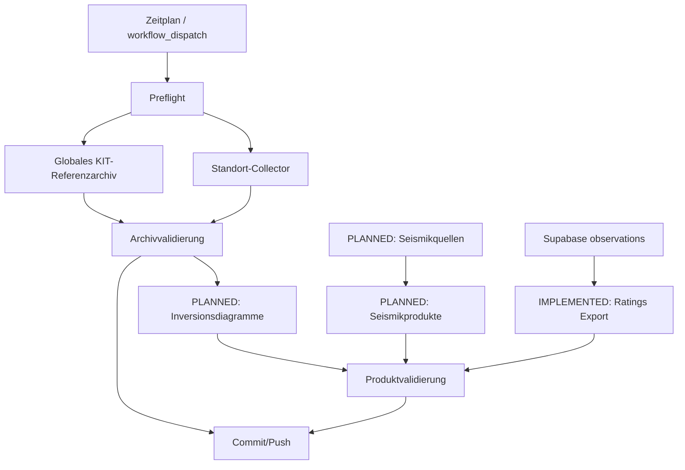
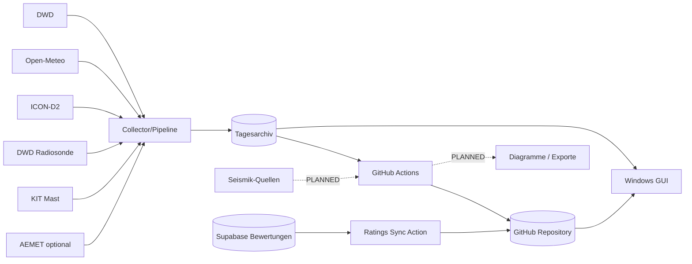
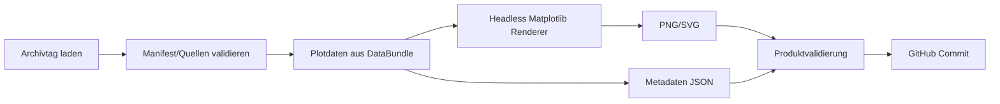
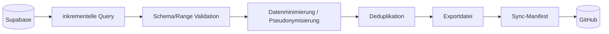

# InversionAnalyzer – COMPLETE DOCUMENTATION
Projektversion: **0.15.24**  
Dokumentationsstand: 2026-09-19
> Diese Datei ist eine kumulative Lesefassung. Verbindlich sind die einzelnen Dateien unter `docs/`.


---

<!-- SOURCE: docs/00_overview/DOCUMENTATION_INDEX.md -->

# Documentation Index

> Dokumentationsstand: 2026-09-19  \n> Software-Basis: Inversion Analyzer v0.15.24  \n> Statusbegriffe: **IMPLEMENTED** = im Quellstand nachweisbar; **PLANNED** = beschlossen/geplant, noch nicht implementiert; **OPEN** = Detailentscheidung fehlt.

## 1. Zweck

Dieser Index ist der verbindliche Einstieg in die Projektdokumentation. Der Dokumentationssatz beschreibt den reproduzierbaren Ist-Stand v0.15.24 und trennt ihn von der Zielarchitektur für die geplanten Automatisierungen.

## 2. Verbindliche Dokumente

| Bereich | Dokument | Zweck |
|---|---|---|
| Überblick | `00_overview/STATUS_AND_SCOPE.md` | Geltungsbereich und Statusmodell |
| Anforderungen | `01_requirements/SRS.md` | funktionale und nichtfunktionale Anforderungen |
| Anforderungen | `01_requirements/TRACEABILITY_MATRIX.md` | Requirement → Design → Code → Test |
| Architektur | `02_architecture/SAD.md` | Systemarchitektur |
| Architektur | `02_architecture/SDS.md` | Softwaredesign / Module |
| Architektur | `02_architecture/AUTOMATION_ARCHITECTURE.md` | bestehende und geplante Automatisierung |
| Architektur | `02_architecture/AUTOMATION_DEPENDENCY_GRAPH.md` | Abhängigkeiten der Datenflüsse |
| Daten | `03_data/DATA_SOURCES.md` | externe Quellen |
| Daten | `03_data/DATA_FORMAT_SPECIFICATION.md` | Datei- und Datenformate |
| Daten | `03_data/DATA_PRODUCTS_SPEC.md` | erzeugte Datenprodukte |
| Daten | `03_data/ARCHIVE_SPECIFICATION.md` | Archivstruktur und Safe-Merge-Regeln |
| Verarbeitung | `04_processing/INVERSION_ALGORITHMS.md` | Berechnungslogik |
| Verarbeitung | `04_processing/INVERSION_DIAGRAM_PIPELINE.md` | geplante vollständige Diagrammerstellung in Actions |
| Verarbeitung | `04_processing/SEISMIC_DATA_PIPELINE.md` | geplante Seismik-Pipeline |
| Verarbeitung | `04_processing/SUPABASE_GITHUB_TRANSFER_SPEC.md` | implementierter Bewertungstransfer; Audio geplant |
| Verarbeitung | `04_processing/SYNC_STATE_SPEC.md` | Idempotenz und Synchronisationszustand |
| GitHub | `05_github/GITHUB_REPOSITORY_SPEC.md` | Repository-Regeln |
| GitHub | `05_github/GITHUB_ACTIONS_SPEC.md` | Workflow-Spezifikation |
| GitHub | `05_github/GITHUB_OPERATIONS.md` | Betrieb und Fehlerdiagnose |
| Sicherheit | `06_security/SECURITY_AND_SECRETS.md` | Secrets, Datenschutz, Rechte |
| Test | `07_testing/TEST_AND_VALIDATION.md` | Test- und Validierungsspezifikation |
| Test | `07_testing/REGRESSION_TESTS.md` | vorhandene Regressionstests |
| Test | `07_testing/DATA_VALIDATION_SPEC.md` | Plausibilitäts- und Vollständigkeitsprüfungen |
| Test | `07_testing/SELF_TEST_SPECIFICATION.md` | integrierter Selftest |
| Test | `07_testing/TEST_EXECUTION_REPORT.md` | ausgeführter PASS-Nachweis für v0.15.24 |
| Betrieb | `08_operation/BUILD_AND_DEVELOPMENT.md` | Entwicklungs-/Buildumgebung |
| Betrieb | `08_operation/INSTALLATION_AND_USER_MANUAL.md` | Installation und Bedienung |
| Betrieb | `08_operation/OPERATIONS_AND_MONITORING.md` | laufender Betrieb |
| Betrieb | `08_operation/RETRY_AND_ERROR_HANDLING.md` | Retry- und Fehlermodell |
| Betrieb | `08_operation/BACKUP_AND_RECOVERY.md` | Sicherung und Wiederherstellung |
| Betrieb | `08_operation/PROJECT_RECONSTRUCTION.md` | Neuaufbau aus Null |
| Projekt | `09_project/CONFIGURATION_SPECIFICATION.md` | Konfigurationen und Defaults |
| Projekt | `09_project/DEPENDENCIES_AND_SBOM.md` | Abhängigkeiten/SBOM |
| Projekt | `09_project/KNOWN_ISSUES_AND_LIMITATIONS.md` | bekannte Grenzen |
| Projekt | `09_project/DEVELOPMENT_DIRECTIVES.md` | verbindliche Entwicklungsregeln |
| Projekt | `09_project/ADR.md` | Architekturentscheidungen |
| Projekt | `09_project/CHANGELOG_DOCUMENTATION.md` | Dokumentationsänderungen |
| Projekt | `09_project/SOURCE_PROVENANCE.md` | Herkunft und Integritätsnachweis |

## 3. Rekonstruktionsziel

Ein technisch versierter Entwickler soll mit Quellstand + Dokumentationssatz eine lauffähige lokale Installation und die GitHub-Automatisierung rekonstruieren können, ohne auf den bisherigen Chatverlauf angewiesen zu sein.

## 4. Historische Unterlagen

`docs/superpowers/` bleibt unverändert als interne frühere Design-/Planungsablage erhalten. Die verbindliche neue Projektdokumentation befindet sich in den oben gelisteten Verzeichnissen.

## Änderung durch Projektversion 0.15.24

Die Dokumentation beschreibt die Supabase-Bewertungssynchronisation nun als **IMPLEMENTED**. Maßgebliche Dateien sind `SUPABASE_GITHUB_TRANSFER_SPEC.md`, `SYNC_STATE_SPEC.md`, `GITHUB_ACTIONS_SPEC.md`, `SECURITY_AND_SECRETS.md`, `ARCHIVE_SPECIFICATION.md` und `REGRESSION_TESTS.md`. Audio-Synchronisation bleibt **PLANNED**.


### Zusätzliche Betriebsanleitung v0.15.24

- `docs/05_github/SUPABASE_RATINGS_ACTION_SETUP.md` – Einrichten des Secrets, erster Vollimport, Prüfung und Regelbetrieb der Bewertungssynchronisation.


---

<!-- SOURCE: docs/00_overview/STATUS_AND_SCOPE.md -->

# Status and Scope

> Dokumentationsstand: 2026-09-19  \n> Software-Basis: Inversion Analyzer v0.15.24  \n> Statusbegriffe: **IMPLEMENTED** = im Quellstand nachweisbar; **PLANNED** = beschlossen/geplant, noch nicht implementiert; **OPEN** = Detailentscheidung fehlt.

## 1. Systemzweck

Der Inversion Analyzer sammelt, archiviert, bewertet und visualisiert Temperatur- und Vertikalprofildaten zur Beurteilung von Inversionslagen. GUI und Headless-Collector verwenden dasselbe Tagesarchiv.

## 2. Nachweisbarer Ist-Stand

**IMPLEMENTED v0.15.24:**

- Windows-/Python-GUI über `Inversionskurve.py` und `inversion/gui.py`.
- Headless-Collector `Inversion_Server.py`.
- standortbezogene Tagesarchive unter `archive/<Ort>/YYYY/MM/DD/`.
- globales KIT-Referenzarchiv unter `archive/KITMast/YYYY/MM/DD/`.
- Datenquellen DWD, Open-Meteo-Vertikalprofil, ICON-D2, Radiosonde, KIT-Mast und optional AEMET.
- GitHub Actions Workflow `.github/workflows/inversion_collect.yml` mit `normal`, `scheduled`, `kit-only`.
- Remote-GitHub-Raw-Nachladen einschließlich transaktionalem KIT-Referenzdownload.
- Safe-Merge/NO-TOUCH bei Teilläufen; vorhandene gute Daten werden bei Fehlabfragen nicht gelöscht.
- Regressionstests für zentrale KIT-/Workflow-Funktionen.

## 3. Geplante Erweiterungen

**PLANNED:**

1. GitHub Actions erzeugt vollständige Inversionsdiagramme als reproduzierbare Datenprodukte.
2. GitHub Actions ruft seismische Diagramme ab und/oder erzeugt sie aus Rohdaten; genaue Quellen-/Stationsliste ist konfigurierbar.
3. Audioaufnahmen werden aus Supabase abgerufen und daraus definierte akustische Kennwerte (u. a. L50/L90/Leq) berechnet und zeitbezogen archiviert.
4. Für die verbleibenden Erweiterungen werden automatische Validierungs- und Regressionstests ergänzt.

## 4. Nicht behauptet

Die Bewertungssynchronisation ist seit v0.15.24 **IMPLEMENTED**. Automatische vollständige Inversionsdiagramme, Seismik-Automatisierung und Audioanalyse sind weiterhin **PLANNED**. Für diese Bereiche beschreibt die Dokumentation Zielarchitektur und Akzeptanzkriterien, nicht bereits vorhandenen Code.


## v0.15.24 – Supabase-Bewertungen (IMPLEMENTED)

- IMPLEMENTED: separater Supabase→GitHub-Import für subjektive Bewertungen aus `observations`.
- IMPLEMENTED: automatische GitHub Action bei Minute 12 und 42 jeder Stunde.
- IMPLEMENTED: idempotente Deduplikation über `event_id`.
- IMPLEMENTED: Tagesarchiv `archive/ratings/YYYY/MM/YYYY-MM-DD/ratings.jsonl` plus `summary.json`.
- IMPLEMENTED: inkrementeller Sync-State mit 48-h-Überlappung gegen verspätete Uploads.
- IMPLEMENTED: Datenschutz-Default ohne Kommentartext und ohne exakte GPS-Koordinaten.
- PLANNED: Audioabruf und Ableitung von L50/L90/Leq und weiteren Kennwerten.


---

<!-- SOURCE: docs/01_requirements/SRS.md -->

# Software Requirements Specification (SRS)

> Dokumentationsstand: 2026-09-19  \n> Software-Basis: Inversion Analyzer v0.15.24  \n> Statusbegriffe: **IMPLEMENTED** = im Quellstand nachweisbar; **PLANNED** = beschlossen/geplant, noch nicht implementiert; **OPEN** = Detailentscheidung fehlt.

## 1. Funktionale Anforderungen – Ist-Stand

| ID | Anforderung | Status |
|---|---|---|
| REQ-DATA-001 | Das System muss Tagesdaten für einen konfigurierten Standort erfassen können. | IMPLEMENTED |
| REQ-DATA-002 | DWD-Bodenmessung und Open-Meteo-Vertikalprofil müssen getrennt erfasst werden. | IMPLEMENTED |
| REQ-DATA-003 | ICON-D2, Radiosonde und KIT dürfen als getrennte Zusatz-/Referenzreihen vorliegen. | IMPLEMENTED |
| REQ-ARCH-001 | Tagesdaten müssen dauerhaft im gemeinsamen Archiv gespeichert werden. | IMPLEMENTED |
| REQ-ARCH-002 | Teil-/Retry-Läufe dürfen nicht angeforderte Quelldateien nicht verändern. | IMPLEMENTED |
| REQ-ARCH-003 | Fehlgeschlagene KIT-Abrufe dürfen vorhandene gute KIT-Profile nicht löschen. | IMPLEMENTED |
| REQ-LOC-001 | Mehrere Orte müssen über `locations.json` unterstützt werden. | IMPLEMENTED |
| REQ-GUI-001 | Ein vorhandener Archivtag muss in der GUI ohne Netzwerkabruf darstellbar sein. | IMPLEMENTED |
| REQ-GUI-002 | Ein explizites Update darf aktivierte Quellen nachladen. | IMPLEMENTED |
| REQ-AUTO-001 | Der Headless-Collector muss zeitgesteuert und manuell ausführbar sein. | IMPLEMENTED |
| REQ-AUTO-002 | GitHub Actions muss alle Orte oder einen ausgewählten Ort verarbeiten können. | IMPLEMENTED |
| REQ-REMOTE-001 | Fehlende Archivdaten können aus einem konfigurierten GitHub-Raw-Archiv nachgeladen werden. | IMPLEMENTED |
| REQ-QA-001 | Die Kernqualität muss unabhängig von optionalen Referenzquellen bestimmt werden. | IMPLEMENTED |

## 2. Geplante Anforderungen – Inversionsdiagramme

| ID | Anforderung | Status |
|---|---|---|
| REQ-DIAG-001 | Actions muss nach erfolgreicher Tagesdatenverarbeitung ein vollständiges Inversionsdiagramm erzeugen können. | PLANNED |
| REQ-DIAG-002 | Diagramme müssen aus archivierten numerischen Daten reproduzierbar sein; PNG allein genügt nicht. | PLANNED |
| REQ-DIAG-003 | Jeder Diagrammoutput benötigt Metadaten mit Softwareversion, Datum, Standort, Eingangsmanifest und Erstellzeit. | PLANNED |
| REQ-DIAG-004 | Bei unzureichender Datenqualität darf kein scheinbar gültiges Diagramm erfunden werden; Status/Fehler muss sichtbar bleiben. | PLANNED |

## 3. Geplante Anforderungen – Seismik

| ID | Anforderung | Status |
|---|---|---|
| REQ-SEIS-001 | Seismische Tagesdiagramme müssen automatisiert pro konfigurierter Station abrufbar sein. | PLANNED |
| REQ-SEIS-002 | Wenn Rohdaten verfügbar und unterstützt sind, muss eine lokale Diagrammerzeugung möglich sein. | PLANNED |
| REQ-SEIS-003 | Quelle, Station, Zeitbasis und Original-/erzeugter Status müssen archiviert werden. | PLANNED |
| REQ-SEIS-004 | HTTP-Fehler oder veraltete Diagramme dürfen nicht als erfolgreicher Tagesabruf gelten. | PLANNED |

## 4. Anforderungen – Supabase → GitHub (Bewertungen Phase 1)

| ID | Anforderung | Status |
|---|---|---|
| REQ-SYNC-001 | Neue Bewertungen müssen inkrementell aus Supabase exportiert werden. | IMPLEMENTED |
| REQ-SYNC-002 | Wiederholte Läufe müssen idempotent sein und dürfen keine Duplikate erzeugen. | IMPLEMENTED |
| REQ-SYNC-003 | Secrets dürfen nicht in Repository, Log oder Exportdatei geschrieben werden. | IMPLEMENTED |
| REQ-SYNC-004 | Nur ausdrücklich freigegebene bzw. pseudonymisierte Felder dürfen nach GitHub gelangen. | IMPLEMENTED |
| REQ-SYNC-005 | Der Transfer muss einen nachvollziehbaren Sync-Zustand und Validierungsbericht erzeugen. | IMPLEMENTED |

## 5. Nichtfunktionale Anforderungen

- **Reproduzierbarkeit:** numerische Eingaben, Parameter und Versionen müssen nachvollziehbar bleiben.
- **Robustheit:** Netzwerkfehler dürfen bestehende gute Daten nicht zerstören.
- **Testbarkeit:** früher behobene Fehler werden als Regressionstest konserviert.
- **Selftest:** wesentliche Parser, Konfigurationen und Archivpfade erhalten automatische PASS/FAIL-Prüfungen.
- **Portabilität:** lokaler Betrieb unter Windows/Python 3.11; Actions unter Ubuntu/Python 3.11.
- **Datenschutz:** Bewertungen/Standortbezug werden nach Datenminimierung behandelt.
- **Nachvollziehbarkeit:** Requirement, Codepfad und Test werden über die Traceability-Matrix verbunden.


## Anforderungen v0.15.24 – Bewertungsimport

- **REQ-RATING-SYNC-001 (IMPLEMENTED):** Das System muss Bewertungen aus Supabase automatisiert abrufen können.
- **REQ-RATING-SYNC-002 (IMPLEMENTED):** `event_id` muss der unveränderliche Deduplikationsschlüssel sein.
- **REQ-RATING-SYNC-003 (IMPLEMENTED):** Ein Wiederholungslauf darf keine doppelten Bewertungen erzeugen.
- **REQ-RATING-SYNC-004 (IMPLEMENTED):** Bewertung `0` und `-1` müssen getrennt bleiben.
- **REQ-RATING-SYNC-005 (IMPLEMENTED):** Archivierung muss entlang einer UTC-Zeitachse tageweise erfolgen.
- **REQ-RATING-SYNC-006 (IMPLEMENTED):** Kommentartext darf in dieser Ausbaustufe nicht nach GitHub exportiert werden.
- **REQ-RATING-SYNC-007 (IMPLEMENTED):** Exakte Beobachtungskoordinaten dürfen im Default nicht exportiert werden; die Defaultdarstellung wird auf zwei Dezimalstellen abgeschnitten.
- **REQ-RATING-SYNC-008 (IMPLEMENTED):** Supabase-Backend-Schlüssel dürfen ausschließlich aus Secret-Umgebungsvariablen gelesen werden.


---

<!-- SOURCE: docs/01_requirements/TRACEABILITY_MATRIX.md -->

# Traceability Matrix

> Dokumentationsstand: 2026-09-19  \n> Software-Basis: Inversion Analyzer v0.15.24  \n> Statusbegriffe: **IMPLEMENTED** = im Quellstand nachweisbar; **PLANNED** = beschlossen/geplant, noch nicht implementiert; **OPEN** = Detailentscheidung fehlt.

## 1. Ist-Stand

| Requirement | Design/Komponente | Implementierung | Test/Nachweis |
|---|---|---|---|
| REQ-DATA-001 | Pipeline | `inversion/pipeline.py` | Headless-Selftest + manuelle Tagesläufe |
| REQ-ARCH-001 | Archivschicht | `inversion/archive.py` | `--verify-archive` |
| REQ-ARCH-002 | Safe-Merge/NO-TOUCH | `archive.merge_bundles`, `save_bundle` | bestehende KIT-/Archivtests |
| REQ-ARCH-003 | KIT Safe-Merge | `inversion/kit_reference_archive.py` | `test_kit_reference_archive_v0_15_22.py`, `test_gui_kit_reference_remote_v0_15_23.py` |
| REQ-LOC-001 | Standortkonfiguration | `locations.json`, `config.py`, `runtime_location.py` | Workflow Preflight für jeden Ort |
| REQ-AUTO-001 | Headless CLI | `Inversion_Server.py` | `--selftest`, `--show-config`, `--verify-archive` |
| REQ-AUTO-002 | Actions | `.github/workflows/inversion_collect.yml` | `test_workflow_dispatch_modes_v0_15_21.py`, `test_workflow_global_kit_v0_15_22.py` |
| REQ-REMOTE-001 | Remote-Archiv | `remote_archive.py`, `archive_service.py` | `test_gui_kit_reference_remote_v0_15_23.py` |

## 2. Ziel-Traceability für die Erweiterungen

| Requirement | Zielkomponente | Zieltest |
|---|---|---|
| REQ-DIAG-001..004 | `diagram_export.py` oder äquivalentes Modul + Actions-Step | Golden-file/Metadaten-Test, fehlende-Daten-Test |
| REQ-SEIS-001..004 | `seismic_source.py`, `seismic_plot.py` + Workflow/Step | HTTP-/Stale-/Format-/Plot-Regressionstests |
| REQ-SYNC-001..005 | `inversion/supabase_ratings.py`, `sync_supabase_ratings.py`, Sync-State + `supabase_ratings_sync.yml` | `test_supabase_ratings_sync_v0_15_24.py`, `test_supabase_ratings_workflow_v0_15_24.py` |

Bei Implementierung ist diese Matrix **im selben Commit** zu aktualisieren.

## v0.15.24 Bewertungs-Synchronisation

| Requirement | Design/Code | Workflow | Test | Status |
|---|---|---|---|---|
| REQ-RATING-SYNC-001 | `inversion/supabase_ratings.py`, `sync_supabase_ratings.py` | `supabase_ratings_sync.yml` | `test_supabase_ratings_sync_v0_15_24.py` | IMPLEMENTED |
| REQ-RATING-SYNC-002/003 | Merge über `event_id` | `supabase_ratings_sync.yml` | Idempotenztest | IMPLEMENTED |
| REQ-RATING-SYNC-004 | Ratingvalidierung -1..5 | `supabase_ratings_sync.yml` | 0/-1-Test | IMPLEMENTED |
| REQ-RATING-SYNC-005 | UTC-Day-Partition | `supabase_ratings_sync.yml` | Tageswechseltest | IMPLEMENTED |
| REQ-RATING-SYNC-006/007 | Sanitization/Privacy | `supabase_ratings_sync.yml` | Kommentar-/GPS-Test | IMPLEMENTED |
| REQ-RATING-SYNC-008 | `resolve_supabase_key()` | GitHub Secrets | Workflow-Preflight | IMPLEMENTED |


---

<!-- SOURCE: docs/02_architecture/AUTOMATION_ARCHITECTURE.md -->

# Automation Architecture

> Dokumentationsstand: 2026-09-19  \n> Software-Basis: Inversion Analyzer v0.15.24  \n> Statusbegriffe: **IMPLEMENTED** = im Quellstand nachweisbar; **PLANNED** = beschlossen/geplant, noch nicht implementiert; **OPEN** = Detailentscheidung fehlt.

## 1. IMPLEMENTED v0.15.24

Ein Workflow `inversion_collect.yml` führt auf `ubuntu-latest` aus. Er besitzt:

- `workflow_dispatch` mit `mode`, `date`, `force`, `location`,
- Zeitplan `7,37 * * * *`,
- `contents: write`,
- gemeinsame Archiv-Concurrency-Gruppe `inversion-archive-writer`,
- Python 3.11,
- Preflight pro Standort,
- globalen KIT-Referenzschritt,
- scheduled/manual Collect,
- Commit/Push von `archive/`.

## 2. PLANNED – Erweiterungsstufen

Empfohlene logische Stufen:

1. **Collect:** bestehende Wetter-/Profil-/KIT-Daten aktualisieren.
2. **Validate:** Manifest, Quellenstatus, zeitliche Abdeckung prüfen.
3. **Create inversion products:** vollständige Diagramme/Metadaten erzeugen.
4. **Collect/Create seismic products:** Stationsprodukte holen/erzeugen.
5. **Transfer ratings:** **IMPLEMENTED v0.15.24** als separater Workflow; neue freigegebene Bewertungen aus Supabase exportieren.
6. **Validate products:** Schema, Dateigrößen, Zeitstempel und Deduplikation prüfen.
7. **Commit:** ausschließlich validierte Artefakte committen.

## 3. Workflow-Aufteilung

Wetter/KIT und Bewertungen sind seit v0.15.24 in getrennten Workflows realisiert und durch `inversion-archive-writer` serialisiert. Weitere Funktionen können als eigene Workflows oder klar getrennte Steps ergänzt werden; verbindlich ist die logische Trennung.

## 4. Fehlerisolation

Ein Seismik- oder Supabase-Fehler darf vorhandene Inversionsarchivdaten nicht löschen. Ein fehlgeschlagener Diagrammexport darf den erfolgreichen Rohdatenabruf nicht rückgängig machen. Commit-Regeln müssen Teilprodukte eindeutig markieren.


---

<!-- SOURCE: docs/02_architecture/AUTOMATION_DEPENDENCY_GRAPH.md -->

# Automation Dependency Graph

> Dokumentationsstand: 2026-09-19  \n> Software-Basis: Inversion Analyzer v0.15.24  \n> Statusbegriffe: **IMPLEMENTED** = im Quellstand nachweisbar; **PLANNED** = beschlossen/geplant, noch nicht implementiert; **OPEN** = Detailentscheidung fehlt.



## Abhängigkeitsregel

Rohdaten-/Archivpflege ist die primäre Schicht. Der Bewertungsexport ist seit v0.15.24 als separater nachgelagerter Workflow implementiert; weitere Datenprodukte bleiben geplant. Ein Ausfall in einer nachgelagerten Schicht darf die Integrität des primären Archivs nicht beeinträchtigen.


---

<!-- SOURCE: docs/02_architecture/SAD.md -->

# System Architecture Document (SAD)

> Dokumentationsstand: 2026-09-19  \n> Software-Basis: Inversion Analyzer v0.15.24  \n> Statusbegriffe: **IMPLEMENTED** = im Quellstand nachweisbar; **PLANNED** = beschlossen/geplant, noch nicht implementiert; **OPEN** = Detailentscheidung fehlt.

## 1. Kontext



## 2. Laufzeitkomponenten

1. **GUI:** `Inversionskurve.py` → `inversion.gui.InversionApp`.
2. **Headless:** `Inversion_Server.py` für einmalige, geplante und KIT-only-Läufe.
3. **Pipeline:** `inversion/pipeline.py` ruft Quellen auf und erzeugt `DataBundle`.
4. **Berechnung:** `inversion/inversion_engine.py` und `inversion/kit_inversion.py`.
5. **Archiv:** `inversion/archive.py`, `archive_service.py`, `kit_reference_archive.py`.
6. **Remote-Fallback:** `inversion/remote_archive.py`.
7. **Automatisierung:** `.github/workflows/inversion_collect.yml` und `.github/workflows/supabase_ratings_sync.yml`.

## 3. Architekturprinzipien

- Ein gemeinsames Archiv für GUI und Headless-Verarbeitung.
- Datenquellen bleiben semantisch getrennt; Referenzdaten werden nicht stillschweigend in das Hauptmodell gemischt.
- Standortarchiv und globales KIT-Referenzarchiv sind getrennt.
- Netzwerkzugriff ist beim reinen Archiv-Navigieren der GUI nicht erforderlich.
- Teilläufe werden per Safe-Merge in vorhandene Tagesstände integriert.
- Kernquellen bestimmen Vollständigkeit; optionale Quellen blockieren standardmäßig keinen Retry.

## 4. Zielarchitektur

Der Supabase-Bewertungsexport ist seit v0.15.24 als separater nachgelagerter Workflow angebunden. Inversionsdiagramme, Seismikprodukte und Audioanalyse bleiben geplant. Die bestehende meteorologische Erfassung darf durch Fehler in nachgelagerten Produkten nicht beeinträchtigt werden.


---

<!-- SOURCE: docs/02_architecture/SDS.md -->

# Software Design Specification (SDS)

> Dokumentationsstand: 2026-09-19  \n> Software-Basis: Inversion Analyzer v0.15.24  \n> Statusbegriffe: **IMPLEMENTED** = im Quellstand nachweisbar; **PLANNED** = beschlossen/geplant, noch nicht implementiert; **OPEN** = Detailentscheidung fehlt.

## 1. Modulübersicht


## 2. Verantwortlichkeiten

| Modul | Verantwortung |
|---|---|
| `inversion/config.py` | Laufzeitkonfiguration, aktive Location, URLs, Archiveinstellungen |
| `inversion/models.py` | `SourceStatus`, `DataBundle` |
| `inversion/pipeline.py` | Orchestrierung der Quellen pro Datum |
| `inversion/inversion_engine.py` | Profilmetriken und lokaler Stratifikationsindex |
| `inversion/archive.py` | Tagesarchiv, Merge, Manifest, Quellstatus |
| `inversion/archive_service.py` | GUI-/Servicezugriff auf Archiv und Updates |
| `inversion/remote_archive.py` | GitHub-Raw-Nachladen |
| `inversion/kit_reference_archive.py` | globales KIT-Referenzarchiv und Safe-Merge |
| `inversion/gui.py` | Tkinter-/Matplotlib-GUI |
| `Inversion_Server.py` | CLI, Selftest, Scheduled/Retry-Logik |
| `inversion/supabase_ratings.py` | Supabase-REST-Abruf, Datenschutzabbildung, Deduplikation, Tagesarchiv und Sync-State |
| `sync_supabase_ratings.py` | headless CLI für Bewertungssynchronisation |

## 3. Zentrale Datenobjekte

`SourceStatus` hält Zustand, Meldung, Zeitpunkte, HTTP-Status, Zeilenanzahl und Abdeckungsdiagnosen. `DataBundle` bündelt alle Quellen- und Ergebnis-DataFrames sowie Qualitätsklasse/-text.

## 4. Erweiterungsdesign

Neue Automatisierungsfunktionen sollen **nicht** in `gui.py` implementiert werden. Empfohlen sind klar getrennte headless-fähige Module für:

- Diagrammexport,
- Seismikquelle/-plot,
- Supabase-Audioimport und Audio-Kennwerte; **der Bewertungsimport und Sync-State sind seit v0.15.24 bereits als headless Module implementiert**.

Diese Module müssen unabhängig von Tkinter importierbar und in Actions testbar sein.


---

<!-- SOURCE: docs/03_data/ARCHIVE_SPECIFICATION.md -->

# Archive Specification

> Dokumentationsstand: 2026-09-19  \n> Software-Basis: Inversion Analyzer v0.15.24  \n> Statusbegriffe: **IMPLEMENTED** = im Quellstand nachweisbar; **PLANNED** = beschlossen/geplant, noch nicht implementiert; **OPEN** = Detailentscheidung fehlt.

## 1. Prinzipien

- Das Archiv ist die gemeinsame Wahrheit für GUI und Headless-Betrieb.
- Standorttage und globale KIT-Referenz sind getrennt.
- Teilabrufe dürfen nicht angeforderte Dateien nicht verändern.
- Ein fehlgeschlagener/leer zurückgegebener Abruf löscht keine gute bestehende Quelle.
- `manifest.json` und `source_status.json` dürfen nach Retry aktualisiert werden.

## 2. Vollständigkeit

Standard-Kernquellen aus `archive_config.json`: `dwd`, `profile`, `icon_d2`. Optionale Quellen: `sonde`, `kit_mast`. Standorte können dies überschreiben; Valencia nutzt beispielsweise nur `profile` als Completion-Source und `aemet` optional.

## 3. KIT

Seit v0.15.22: `archive/KITMast/...` ist global. `kit_reference=true` bindet dieses Referenzarchiv an einen Ort an, ohne per-Location-Duplikation.

## 4. Remote-Fallback

Fehlende Tage können aus GitHub Raw nachgeladen werden. Der KIT-Referenzdownload wird seit v0.15.23 zunächst in ein Staging-Verzeichnis geladen und erst bei vollständigem Erfolg übernommen.

## 5. Geplante Archive

Seismik und Ratings erhalten eigene Namespaces, damit sie nicht mit standortbezogenen meteorologischen Kerndaten verwechselt werden.


## Bewertungsarchiv ab v0.15.24 (IMPLEMENTED)

```text
archive/ratings/
├── sync_state.json
└── YYYY/MM/YYYY-MM-DD/
    ├── ratings.jsonl
    └── summary.json
```

`ratings.jsonl` enthält pro Zeile genau eine kanonische Bewertung. `event_id` ist eindeutig. Die Datei ist deterministisch nach `response_time_utc`, danach `event_id`, sortiert. `summary.json` enthält Tag, Anzahl Bewertungen, Anzahl pseudonymer Beobachter sowie getrennte Häufigkeiten für `-1,0,1,2,3,4,5`.


---

<!-- SOURCE: docs/03_data/DATA_FORMAT_SPECIFICATION.md -->

# Data and File Format Specification

> Dokumentationsstand: 2026-09-19  \n> Software-Basis: Inversion Analyzer v0.15.24  \n> Statusbegriffe: **IMPLEMENTED** = im Quellstand nachweisbar; **PLANNED** = beschlossen/geplant, noch nicht implementiert; **OPEN** = Detailentscheidung fehlt.

## 1. Standort-Tagesarchiv

Pfad: `archive/<LocationSlug>/YYYY/MM/DD/`

Typische CSV-Dateien:

- `dwd_ground.csv`
- `aemet_ground.csv`
- `openmeteo_profile.csv`
- `inversion_model.csv`
- `radiosonde_profile.csv`
- `radiosonde_metrics.csv`
- `icon_d2.csv`
- `icon_d2_profile.csv`

Typische JSON-Dateien:

- `manifest.json`
- `source_status.json`
- `station_info.json`
- `sonde_profiles.json`
- `sonde_flights.json`
- `icon_d2_info.json`

Bei `kit_reference=true` werden KIT-Dateien nicht im Standortordner dupliziert.

## 2. Globales KIT-Referenzarchiv

Pfad: `archive/KITMast/YYYY/MM/DD/`

- `kit_mast.csv`
- `kit_mast_info.json`
- `kit_mast_data.json` (falls vorhanden)
- `source_status.json`
- `manifest.json`

## 3. Manifest

Standortmanifeste verwenden derzeit `schema_version: 1` und enthalten u. a. `app_version`, Location-Metadaten, Datum, `saved_at`, `run_id`, Qualitätsklasse, Vollständigkeit, Kern-/optionale Quellen, Retry-Information und Dateizuordnung.

## 4. PLANNED Datenprodukte

Empfohlene Struktur:

```text
archive/<Ort>/YYYY/MM/DD/products/
  inversion_diagram.png
  inversion_diagram.svg            # optional
  inversion_diagram_metadata.json

archive/Seismic/<Station>/YYYY/MM/DD/
  source_image.png                  # falls Originalprodukt
  seismic_diagram.png               # falls selbst erzeugt
  metadata.json
  raw/...                           # falls Rohdaten zulässig/verfügbar

archive/Ratings/YYYY/MM/DD/
  ratings.jsonl                     # oder CSV; Entscheidung vor Implementierung fixieren
  sync_manifest.json
```

Numerische Daten sind vorrangig; Bilder sind reproduzierbare Ansichten.


## Rating JSONL v1.0 (IMPLEMENTED ab v0.15.24)

Beispielstruktur:

```json
{
  "schema_version": "1.0",
  "event_id": "UUID",
  "observer_id": "BB001",
  "scheduled_time_utc": "2026-09-18T20:00:00.000Z",
  "response_time_utc": "2026-09-18T20:00:12.000Z",
  "rating": 3,
  "location": {
    "available": true,
    "latitude": 49.54,
    "longitude": 8.57,
    "precision": "truncated_2dp"
  },
  "app_version": "0.4.84",
  "has_comment": false,
  "source": "LFN-Scout/Supabase"
}
```

Der Kommentartext wird im Default nicht exportiert. Die genauen Supabase-Koordinaten werden im Default ebenfalls nicht exportiert.


---

<!-- SOURCE: docs/03_data/DATA_PRODUCTS_SPEC.md -->

# Data Products Specification

> Dokumentationsstand: 2026-09-19  \n> Software-Basis: Inversion Analyzer v0.15.24  \n> Statusbegriffe: **IMPLEMENTED** = im Quellstand nachweisbar; **PLANNED** = beschlossen/geplant, noch nicht implementiert; **OPEN** = Detailentscheidung fehlt.

## 1. Bestehende Datenprodukte

- archivierte Roh-/Quelltabellen,
- `inversion_model.csv`,
- GUI-Plot sowie manueller PNG-/CSV-Export,
- Quellstatus und Tagesmanifest.

## 2. PLANNED: automatisches Inversionsdiagramm

Ein vollständiges Tagesprodukt muss enthalten:

- Standort und Datum,
- Haupt-Inversionskurve/Index,
- lokale Stratifikationsinformation soweit vorhanden,
- getrennte Referenz-/Zusatzreihen (KIT, Radiosonde, ICON-D2) nur wenn verfügbar,
- Qualitätsklasse und Datenherkunft,
- Software-/Schema-Version,
- Hinweis auf fehlende Daten statt künstlicher Nullkurve.

## 3. PLANNED: Seismikprodukt

Metadaten müssen Originalquelle, Station, Produktzeitraum, Abrufzeit, Original-vs-generated, Content-Hash, Validierungsergebnis und ggf. Rohdatenreferenz enthalten.

## 4. PLANNED: Bewertungsprodukt

Bewertungsexporte müssen schema-versioniert, deterministisch sortierbar und deduplizierbar sein. Persönliche oder präzise Standortdaten werden nur nach expliziter Freigabe und definierter Datenschutzstrategie exportiert.


---

<!-- SOURCE: docs/03_data/DATA_SOURCES.md -->

# Data Sources

> Dokumentationsstand: 2026-09-19  \n> Software-Basis: Inversion Analyzer v0.15.24  \n> Statusbegriffe: **IMPLEMENTED** = im Quellstand nachweisbar; **PLANNED** = beschlossen/geplant, noch nicht implementiert; **OPEN** = Detailentscheidung fehlt.

## 1. Implementierte Quellen

| Quelle | Verwendung | Endpunkt/Quelle im Code | Status |
|---|---|---|---|
| DWD 10-min Lufttemperatur | Bodenmessung DE | `opendata.dwd.de/.../10_minutes/air_temperature/now/` | IMPLEMENTED |
| Open-Meteo Forecast/Archive | Vertikalprofil | `api.open-meteo.com`, `archive-api.open-meteo.com`, historical forecast | IMPLEMENTED |
| ICON-D2 via Open-Meteo | separates Modellprodukt | `historical-forecast-api.open-meteo.com`, Modell `icon_d2` | IMPLEMENTED |
| DWD Radiosonde | hochaufgelöste Sondenprofile | DWD CDC high_resolution recent/historical | IMPLEMENTED |
| KIT 200-m-Mast Karlsruhe | gemessene Referenzprofile | `tsm.atmohub.kit.edu` Bokeh-Plotserver | IMPLEMENTED |
| AEMET | optionale Bodenmessung Spanien | API-Key über `AEMET_API_KEY` | IMPLEMENTED optional |
| Open-Meteo Geocoding | Ortsauflösung | `geocoding-api.open-meteo.com/v1/search` | IMPLEMENTED |
| GitHub Raw | Remote-Archiv-Fallback | owner/repository/branch aus `archive_config.json` | IMPLEMENTED |

## 2. Konfigurierte Orte (unverändert in v0.15.24)

- Viernheim: DE, KIT-Referenz aktiv.
- Bremerhaven: DE, KIT-Referenz aktiv.
- Valencia: Open-Meteo Kernprofil, AEMET optional, KIT/ICON-D2/DWD/Radiosonde deaktiviert.

## 3. PLANNED Seismik

Seismik wird als eigene Quellklasse dokumentiert. Pro Station sind mindestens zu konfigurieren: Betreiber, Station-ID, URL/API, Produktart (fertiges Bild/Rohdaten), Zeitzone, Aktualisierungsintervall, erwartetes Tagesdatum, Format, Hash/Größe und Fallback. Konkrete Stationslisten sind bei Implementierung in Konfiguration + Testdaten festzuschreiben.

## 4. IMPLEMENTED Supabase-Bewertungen

Supabase ist keine Messdatenquelle der Inversionsberechnung, sondern die Intake-/Pufferquelle für subjektive Bewertungen. v0.15.24 liest die Tabelle `observations` serverseitig über den Actions-Workflow `supabase_ratings_sync.yml`; Zugang erfolgt ausschließlich über GitHub Secrets. Exportfelder und Datenschutzabbildung sind in `SUPABASE_GITHUB_TRANSFER_SPEC.md` definiert. Audio bleibt in dieser Version außerhalb des Imports.


---

<!-- SOURCE: docs/04_processing/INVERSION_ALGORITHMS.md -->

# Inversion Algorithms and Derivations

> Dokumentationsstand: 2026-09-19  \n> Software-Basis: Inversion Analyzer v0.15.24  \n> Statusbegriffe: **IMPLEMENTED** = im Quellstand nachweisbar; **PLANNED** = beschlossen/geplant, noch nicht implementiert; **OPEN** = Detailentscheidung fehlt.

## 1. Hauptprofil

`calculate_profile_metrics()` verarbeitet Temperaturwerte auf 2 m und den Druckniveaus 1000, 975, 950, 925, 900 und 850 hPa. Geopotentialhöhen werden von MSL in AGL umgerechnet, indem die konfigurierte Standorthöhe abgezogen wird.

Zwischen vorhandenen Profilpunkten werden Darstellungstemperaturen bei 100, 200 und 500 m linear interpoliert. **Keine Extrapolation** außerhalb der verfügbaren Profilhöhe.

## 2. Positive Temperaturgradienten

Für benachbarte Schichten mit ausreichendem Höhenabstand werden Temperaturdifferenz und Gradient in K/100 m berechnet. Positive Temperaturzunahme mit Höhe trägt zur Inversionsmetrik bei.

## 3. Lokaler Stratifikationsindex

Der Code v0.15.14 ff. bewertet das vollständige verfügbare Profil bis 600 m AGL. Bevorzugter Bodenanker ist eine gemessene Oberflächentemperatur, sonst Modell-2-m.

Normierungen:

- `gradient_score = max positive gradient / 0.5 K je 100 m`, auf 0..1 begrenzt,
- `deltaT_score = Summe positive ΔT / 2.0 K`, auf 0..1 begrenzt,
- `depth_score = positive Schichttiefe / 300 m`, auf 0..1 begrenzt.

Index:

`5 * (0.45*gradient_score + 0.35*deltaT_score + 0.20*depth_score)`

Ergebnisbereich 0..5.

## 4. Datenqualität

Ohne auswertbares Vertikalprofil: Klasse X. Mit DWD- oder AEMET-Bodenmessung + Vertikalprofil: Klasse B. Mit Profil aber fehlender/veralteter Bodenmessung: Klasse C. KIT/Radiosonde bleiben separate Referenzreihen und verändern die Kernklasse nicht.

## 5. Validierungsanforderung

Änderungen an Gewichtungen, Höhen, Druckniveaus oder Interpolation benötigen eine neue Algorithmusversion, Changelog-Eintrag und Regressionstest mit festem Eingabedatensatz.


---

<!-- SOURCE: docs/04_processing/INVERSION_DIAGRAM_PIPELINE.md -->

# Inversion Diagram Pipeline

> Dokumentationsstand: 2026-09-19  \n> Software-Basis: Inversion Analyzer v0.15.24  \n> Statusbegriffe: **IMPLEMENTED** = im Quellstand nachweisbar; **PLANNED** = beschlossen/geplant, noch nicht implementiert; **OPEN** = Detailentscheidung fehlt.

## 1. Status

**PLANNED.** v0.15.23 kann in der GUI darstellen/exportieren, erzeugt aber im vorhandenen GitHub-Workflow noch nicht den hier spezifizierten vollständigen automatischen Diagrammsatz.

## 2. Zielpipeline



## 3. Renderer-Anforderungen

- kein Tkinter-Zwang in Actions,
- deterministische Achsen/Labels für identische Eingaben,
- sichtbare Datenqualität und Datum/Ort,
- Referenzreihen klar getrennt,
- fehlende Daten werden als fehlend markiert,
- Eingangsmanifest-/Datenhashes in Metadaten.

## 4. Erzeugungszeitpunkt

Erzeugung erst nach Archiv-Safe-Merge und Validierung. Bei späteren Datenverbesserungen desselben Tages muss das Diagramm erneut erzeugt werden.

## 5. Tests

- vollständiger Beispieltag,
- Tag ohne DWD,
- Tag ohne optionale Referenzen,
- Tag ohne Vertikalprofil → kein scheinbar gültiges Inversionsdiagramm,
- identischer Input → identisches Metadatenobjekt (abgesehen von Erstellzeit, falls nicht normalisiert).


---

<!-- SOURCE: docs/04_processing/SEISMIC_DATA_PIPELINE.md -->

# Seismic Data Pipeline

> Dokumentationsstand: 2026-09-19  \n> Software-Basis: Inversion Analyzer v0.15.24  \n> Statusbegriffe: **IMPLEMENTED** = im Quellstand nachweisbar; **PLANNED** = beschlossen/geplant, noch nicht implementiert; **OPEN** = Detailentscheidung fehlt.

## 1. Status

**PLANNED.** Seismik ist im Quellstand v0.15.23 noch kein Bestandteil der Pythonmodule oder Actions.

## 2. Unterstützte Betriebsarten

**Mode A – fertiges Diagramm abrufen:** HTTP-Download eines offiziellen Stationsprodukts, Prüfung auf HTTP-Erfolg, Bildformat, Mindestgröße, Datum/Frische und Hash; danach unveränderte Archivierung als Original.

**Mode B – Diagramm selbst erzeugen:** Rohdaten laden, Zeitbasis/Einheit normalisieren, definierte Plotparameter anwenden, Rohdaten + Plot + Metadaten archivieren.

## 3. Stationskonfiguration

Pflichtfelder: `station_id`, `name`, `operator`, `timezone`, `source_type`, `url`, `expected_update`, `archive_slug`, optionale Parser-/Plotparameter.

## 4. Zielablage

`archive/Seismic/<Station>/YYYY/MM/DD/` mit `metadata.json`, Originalprodukt und/oder generiertem Plot sowie optionalen Rohdaten.

## 5. Validierung

Ein HTTP-200 allein reicht nicht. Zu prüfen sind Content-Type, decodierbares Bild/Format, plausible Größe, erwarteter Stationsbezug, Datum/Frische und unveränderte Übernahme des Originals per SHA-256.

## 6. Actions

Seismik soll als isolierter Step/Job laufen. Ausfall einer Station soll andere Stationen und den meteorologischen Collector nicht zerstören. Der Workflow muss im Log pro Station PASS/FAIL/STALE ausgeben.


---

<!-- SOURCE: docs/04_processing/SUPABASE_GITHUB_TRANSFER_SPEC.md -->

# Supabase to GitHub Transfer Specification

> Dokumentationsstand: 2026-09-19  \n> Software-Basis: Inversion Analyzer v0.15.24  \n> Statusbegriffe: **IMPLEMENTED** = im Quellstand nachweisbar; **PLANNED** = beschlossen/geplant, noch nicht implementiert; **OPEN** = Detailentscheidung fehlt.

## 1. Status und Ziel

**IMPLEMENTED für Bewertungen seit v0.15.24.** Audioübertragung und Audioanalyse bleiben **PLANNED**. Bewertungen werden aus Supabase in ein GitHub-Archiv transferiert, ohne Supabase-Secrets oder nicht freigegebene personenbezogene Daten in GitHub zu übertragen.

## 2. Datenfluss



## 3. Exportprinzip

- Primärschlüssel/Observation-ID muss stabil sein.
- Export wird deterministisch sortiert.
- Bereits exportierte IDs werden nicht erneut dupliziert.
- Ein abgebrochener Lauf ist wiederholbar.
- Erst nach erfolgreicher Dateivalidierung darf committed werden.

## 4. Felder

Das Phase-1-Schema ist in v0.15.24 festgelegt: `schema_version`, `event_id`, pseudonyme `observer_id`, `scheduled_time_utc`, `response_time_utc`, `rating`, datenschutzreduzierte `location`, `app_version`, `has_comment` und `source`. Präzise Koordinaten, Teilnehmerschlüssel und Kommentartext werden im Default nicht exportiert.

## 5. Secrets

Supabase URL/Project-Ref kann je nach Sicherheitsmodell öffentlich sein; API-Keys/Service-Role-Key sind jedoch als GitHub Actions Secrets zu behandeln. Service-Role nur verwenden, wenn Row-Level-Security/Exportweg dies wirklich erfordert; minimale Rechte bevorzugen.

## 6. Commit-Verhalten

Die Action verwendet die neutrale Commit-Nachricht `Update Supabase ratings archive`; Nutzerdaten werden nicht in Commit-Nachrichten geschrieben. Logs enthalten nur Summen und technische Statusangaben, nicht den Backend-Key oder Teilnehmerschlüssel.


## Implementierungsstand v0.15.24 – Phase 1 Bewertungen

**Status: IMPLEMENTED für Bewertungen; PLANNED für Audio.**

Datenfluss:

```text
Supabase observations
      ↓ HTTPS REST / secret key
48-h inkrementelles Überlappungsfenster
      ↓
Validierung und Normalisierung
      ↓
event_id-Deduplikation
      ↓
Datenschutzabbildung (GPS 2 Stellen, kein Kommentartext)
      ↓
UTC-Tagesarchiv ratings.jsonl + summary.json
      ↓
sync_state.json
      ↓
GitHub-Commit durch Action
```

Der erste Lauf ohne vorhandenen `sync_state.json` liest den vollständigen Bestand. Danach wird ab `max_response_time_utc - 48 h` erneut gelesen. Das Überlappungsfenster fängt verspätete App-Uploads ab, ohne Duplikate zu erzeugen.

### Zugang

Bevorzugtes Repository Secret: `SUPABASE_SECRET_KEY`. Legacy-Fallback: `SUPABASE_SERVICE_ROLE_KEY`. Die Projekt-URL kann über `SUPABASE_URL` überschrieben werden; der Default steht in `ratings_sync_config.json`.

### Nicht Bestandteil von Phase 1

- kein Audio-Download,
- keine L50/L90/Leq-Berechnung,
- kein Kommentartext-Export,
- keine Löschung von Supabase-Daten nach erfolgreichem Transfer.


---

<!-- SOURCE: docs/04_processing/SYNC_STATE_SPEC.md -->

# Synchronization State Specification

> Dokumentationsstand: 2026-09-19  \n> Software-Basis: Inversion Analyzer v0.15.24  \n> Statusbegriffe: **IMPLEMENTED** = im Quellstand nachweisbar; **PLANNED** = beschlossen/geplant, noch nicht implementiert; **OPEN** = Detailentscheidung fehlt.

## 1. Ziel

Der Supabase→GitHub-Transfer muss exakt nachvollziehbar und idempotent sein.

## 2. Empfohlener Zustand

`archive/Ratings/sync_state.json` oder ein äquivalentes Manifest enthält:

- `schema_version`,
- `last_successful_sync_at_utc`,
- `high_water_mark` (z. B. monotoner Schlüssel/Zeit + ID),
- `exported_record_count`,
- Hash der zuletzt geschriebenen Exportdatei,
- letzte erfolgreiche Workflow-Run-ID,
- optional letzte geprüfte ID.

## 3. Idempotenz

Ein identischer Workflow-Lauf darf denselben GitHub-Stand erzeugen wie ein einzelner Lauf. Dazu wird nicht nur auf Zeitstempel, sondern auf stabile Datensatz-IDs dedupliziert.

## 4. Fehlerfall

Der Sync-State wird **erst nach** erfolgreicher Exportvalidierung und erfolgreichem Schreibvorgang fortgeschrieben. Bei Abbruch bleibt die letzte bestätigte High-Water-Mark erhalten.


## Rating-Sync-State v0.15.24 (IMPLEMENTED)

Datei: `archive/ratings/sync_state.json`. Sie enthält u. a. `last_successful_sync_utc`, `query_since_utc`, `max_response_time_utc`, `archive_event_count`, letzte Fetch-/Reject-Zahlen, Tabellenname und Datenschutzmodus.

Der State ist nur ein Beschleuniger. Konsistenz wird durch die eindeutige `event_id` und das idempotente Merge der Tagesdateien gesichert.


---

<!-- SOURCE: docs/05_github/GITHUB_ACTIONS_SPEC.md -->

# GitHub Actions Specification

> Dokumentationsstand: 2026-09-19  \n> Software-Basis: Inversion Analyzer v0.15.24  \n> Statusbegriffe: **IMPLEMENTED** = im Quellstand nachweisbar; **PLANNED** = beschlossen/geplant, noch nicht implementiert; **OPEN** = Detailentscheidung fehlt.

## 1. Aktueller Workflow

Datei: `.github/workflows/inversion_collect.yml`  
Name: `Inversion data collector`  
Runner: `ubuntu-latest`  
Python: 3.11  
Timeout: 45 Minuten  
Permission: `contents: write`  
Concurrency: `inversion-archive-writer`, kein Cancel laufender Jobs.

## 2. Trigger

### Zeitplan

`7,37 * * * *` – zweimal pro Stunde.

### `workflow_dispatch`

| Input | Werte/Default |
|---|---|
| `mode` | `normal`, `scheduled`, `kit-only`; Default `normal` |
| `date` | optional `YYYY-MM-DD` |
| `force` | boolean, Default false |
| `location` | Schlüssel aus `locations.json` oder `ALL`; Default `Viernheim` |

## 3. Aktuelle Steps

1. Checkout (`actions/checkout@v6`, vollständige History).
2. Setup Python (`actions/setup-python@v7`, 3.11).
3. `pip install requests pandas numpy matplotlib bokeh`.
4. Restore Radiosonden-Cache (`actions/cache@v6`).
5. Locations auflösen.
6. Preflight: `--selftest`, `--show-config`, `--verify-archive` pro Ort.
7. globales KIT-Referenzarchiv für schedule/scheduled/kit-only.
8. scheduled collection oder manual collection.
9. Archivänderungen anzeigen.
10. `git add archive`, Commit und Push, falls Änderungen vorliegen.

## 4. Secrets

Aktuell verwendet: `AEMET_API_KEY`.

Supabase-Bewertungssync verwendet `SUPABASE_SECRET_KEY` (bevorzugt) bzw. vorübergehend `SUPABASE_SERVICE_ROLE_KEY` als GitHub Secret. Keine Secrets in YAML-Literalen, Dateien oder Logs.

## 5. PLANNED Steps

Nach Datenvalidierung und vor Commit:

- `Generate inversion products`.
- `Collect/generate seismic products`.
- `Export ratings from Supabase` – **IMPLEMENTED** als separater Workflow seit v0.15.24.
- `Validate generated products and sync state`.

Die Steps müssen einzeln testbar sein. Optional kann später eine Aufteilung in separate Workflows erfolgen.

## 6. Akzeptanzkriterien für Erweiterung

- manueller Dispatch für jede neue Funktion testbar,
- geplante Läufe ohne interaktive Eingaben,
- keine Secrets im Log,
- Fehler in Zusatzprodukten zerstören kein vorhandenes Archiv,
- Wiederholung erzeugt keine Ratings-Duplikate,
- generierte Diagramme besitzen Metadaten und eindeutigen Tagesbezug.


## Workflow `supabase_ratings_sync.yml` (IMPLEMENTED ab v0.15.24)

| Feld | Wert |
|---|---|
| Zweck | Supabase-Bewertungen ins GitHub-Archiv spiegeln |
| Automatischer Trigger | `12,42 * * * *` |
| Manuell | `workflow_dispatch` |
| Manueller Input | `full=true/false` |
| Python | 3.11 |
| Zusätzliche Python-Pakete | keine |
| Secret | `SUPABASE_SECRET_KEY` bevorzugt |
| Legacy Secret | `SUPABASE_SERVICE_ROLE_KEY` |
| Schreibrecht | `contents: write` |
| Output | `archive/ratings/**` |
| Deduplikation | `event_id` |
| Regressionstests | `test_supabase_ratings_sync_v0_15_24.py`, `test_supabase_ratings_workflow_v0_15_24.py` |
| Concurrency | `inversion-archive-writer`, kein Cancel laufender Jobs |

Der Workflow ist bewusst vom meteorologischen Collector getrennt. Wetter/KIT startet bei Minute 07/37, Bewertungen bei 12/42.

### Gemeinsame Schreibsperre ab v0.15.24

`inversion_collect.yml` und `supabase_ratings_sync.yml` verwenden beide `concurrency.group: inversion-archive-writer` mit `cancel-in-progress: false`. Dadurch werden Archivschreibvorgänge im Repository serialisiert. Zusätzlich wird nach dem Commit vor dem Push `git pull --rebase origin main` ausgeführt.


---

<!-- SOURCE: docs/05_github/GITHUB_OPERATIONS.md -->

# GitHub Operations Guide

> Dokumentationsstand: 2026-09-19  \n> Software-Basis: Inversion Analyzer v0.15.24  \n> Statusbegriffe: **IMPLEMENTED** = im Quellstand nachweisbar; **PLANNED** = beschlossen/geplant, noch nicht implementiert; **OPEN** = Detailentscheidung fehlt.

## 1. Manueller Datenlauf

GitHub → Actions → `Inversion data collector` → Run workflow. Ort/ALL, Modus, optional Datum und Force wählen.

## 2. Diagnose

Bei Fehlern in dieser Reihenfolge prüfen:

1. Preflight-Selftest.
2. aktive Location und `locations.json`.
3. Netzwerk-/HTTP-Fehler einzelner Quellen.
4. KIT-Bokeh-Retrylog.
5. `git status`/Commit-Step.
6. Berechtigungen `contents: write` und Branchschutz.
7. benötigte Secrets.

## 3. Geplanter Betrieb nach Erweiterung

Neue Produktsteps müssen im Actions-Log pro Produkt eine kurze Statuszeile liefern: `PASS`, `NO_DATA`, `STALE`, `FAILED`, plus Pfad. Bei Supabase zusätzlich: Anzahl gelesen, neu, verworfen/ungültig, geschrieben; keine vertraulichen Inhalte.

## 4. Recovery eines fehlgeschlagenen Laufs

Actions-Lauf erneut starten oder `workflow_dispatch` mit dem betroffenen Datum ausführen. Safe-Merge und Idempotenz sind Voraussetzung dafür, dass Wiederholung zulässig ist.


---

<!-- SOURCE: docs/05_github/GITHUB_REPOSITORY_SPEC.md -->

# GitHub Repository Specification

> Dokumentationsstand: 2026-09-19  \n> Software-Basis: Inversion Analyzer v0.15.24  \n> Statusbegriffe: **IMPLEMENTED** = im Quellstand nachweisbar; **PLANNED** = beschlossen/geplant, noch nicht implementiert; **OPEN** = Detailentscheidung fehlt.

## 1. Repository

Die aktuelle Remote-Archivkonfiguration verweist auf Owner `yewie56`, Repository `Inversion-Analyzer`, Branch `main`, Archivpfad `archive`.

## 2. Verzeichnisrollen

- `.github/workflows/`: Automatisierung.
- `inversion/`: Python-Paket.
- `archive/`: versionierte Laufzeitdaten, die Actions aktualisiert.
- `docs/`: Projektdokumentation.
- `cache/`, `logs/`, `output_inversion/`: grundsätzlich Runtime-/lokale Artefakte gemäß `.gitignore` prüfen.

## 3. Branch/Commit-Prinzip

Der vorhandene Workflow arbeitet direkt auf dem ausgecheckten Branch und besitzt `contents: write`. Archivänderungen werden mit Bot-Identität `inversion-collector` committed und gepusht. Für produktive Erweiterungen sind Branchschutz/Tokenrechte gegen den gewünschten Automationsbetrieb abzugleichen.

## 4. Versionierung

Softwareänderungen benötigen Versionsanhebung, Changelog und Regressionstest. Datenarchive ändern die Softwareversion nicht, tragen aber `app_version` im Manifest.


---

<!-- SOURCE: docs/05_github/SUPABASE_RATINGS_ACTION_SETUP.md -->

# Supabase Ratings Action – Einrichtung und erster Lauf

Projektstand: Inversion Analyzer v0.15.24  
Status: IMPLEMENTED

## 1. Zweck

Der Workflow `.github/workflows/supabase_ratings_sync.yml` holt subjektive Bewertungen aus der Supabase-Tabelle `observations` und schreibt eine datenschutzreduzierte Archivkopie nach GitHub.

## 2. Einmalig erforderliches GitHub Secret

Im GitHub-Repository:

1. `Settings` öffnen.
2. `Secrets and variables` → `Actions` öffnen.
3. `New repository secret` wählen.
4. Name: `SUPABASE_SECRET_KEY`.
5. Als Wert einen aktuellen Supabase-Backend-Secret-Key (`sb_secret_...`) eintragen.
6. Secret speichern.

Der Secret-Key darf niemals in `ratings_sync_config.json`, YAML, Python-Code, Logs oder Dokumentation eingetragen werden.

Ein vorhandener alter `service_role`-Key kann über das Secret `SUPABASE_SERVICE_ROLE_KEY` vorübergehend weiterverwendet werden. `SUPABASE_SECRET_KEY` ist der bevorzugte Weg.

## 3. Supabase-Projekt und Tabelle

Default in `ratings_sync_config.json`:

```json
{
  "supabase_url": "https://kbejualnruiwtnmeytif.supabase.co",
  "table": "observations"
}
```

Die URL kann bei Bedarf durch die Actions-Umgebungsvariable bzw. das GitHub Secret `SUPABASE_URL` überschrieben werden.

## 4. Erster Vollimport

1. GitHub-Repository öffnen.
2. `Actions` öffnen.
3. Workflow `Supabase ratings sync` wählen.
4. `Run workflow` anklicken.
5. `full = true` einstellen.
6. Workflow starten.
7. Nach erfolgreichem Lauf prüfen, ob `archive/ratings/` angelegt wurde.

Erwartet:

```text
archive/ratings/
├── sync_state.json
└── YYYY/MM/YYYY-MM-DD/
    ├── ratings.jsonl
    └── summary.json
```

## 5. Automatischer Betrieb

Der Workflow startet bei Minute 12 und 42 jeder Stunde. Der Wetter-/KIT-Collector startet bei Minute 07 und 37. Beide verwenden die gemeinsame Concurrency-Gruppe `inversion-archive-writer`, sodass niemals zwei Archivschreiber gleichzeitig laufen.

## 6. Inkrementeller Betrieb

Nach dem ersten Import liest der Sync nicht bei jedem Lauf die gesamte Tabelle. Er verwendet `max_response_time_utc` aus `sync_state.json` und geht standardmäßig 48 Stunden zurück. Danach werden alle gefundenen Datensätze über `event_id` idempotent in die Tagesdateien gemerged.

Dadurch werden insbesondere verspätete Offline-Uploads nachgeholt.

## 7. Datenschutz im Default

Nach GitHub werden übertragen:

- `event_id`,
- pseudonyme `observer_id`,
- `scheduled_time_utc`,
- `response_time_utc`,
- `rating`,
- auf zwei Dezimalstellen abgeschnittene Koordinaten,
- `app_version`,
- `has_comment`.

Nicht übertragen werden:

- Teilnehmerschlüssel,
- exakte GPS-Koordinaten,
- Kommentartext,
- Audio.

## 8. Manuelle lokale Prüfung

Ohne Secret kann der Regressionstest ausgeführt werden:

```text
python test_supabase_ratings_sync_v0_15_24.py
```

Für einen realen lokalen Supabase-Abruf muss `SUPABASE_SECRET_KEY` nur für den aktuellen Prozess gesetzt sein. Er darf nicht in eine Projektdatei geschrieben werden.

## 9. Erfolgskriterien

Der erste reale GitHub-Lauf gilt als erfolgreich, wenn:

- der Regressionstest PASS meldet,
- der Supabase-Abruf keine verworfenen Datensätze meldet,
- `ratings.jsonl` erzeugt wird,
- `summary.json` zur Anzahl der importierten Bewertungen passt,
- ein zweiter Full-Lauf keine Duplikate erzeugt,
- ein normaler Folgelauf nur notwendige Änderungen committed.


---

<!-- SOURCE: docs/06_security/SECURITY_AND_SECRETS.md -->

# Security and Secrets

> Dokumentationsstand: 2026-09-19  \n> Software-Basis: Inversion Analyzer v0.15.24  \n> Statusbegriffe: **IMPLEMENTED** = im Quellstand nachweisbar; **PLANNED** = beschlossen/geplant, noch nicht implementiert; **OPEN** = Detailentscheidung fehlt.

## 1. Aktuelle Secrets

`AEMET_API_KEY` wird aus GitHub Actions Secrets in die Job-Umgebung gegeben. Zugangstoken dürfen nicht in Projektdateien oder Logs gespeichert werden.

## 2. Supabase-Bewertungssync – IMPLEMENTED

- Secret-Schlüssel ausschließlich über GitHub Actions Secrets.
- Backend-Secret nur im serverseitigen GitHub-Runner; aktuelle `sb_secret_...`-Keys werden bevorzugt.
- Keine Ausgabe von Headern, Token, Connection Strings oder kompletten Response-Objekten mit sensitiven Feldern.
- Der Export wird durch `sanitize_observation()` auf das dokumentierte Ausgabeschema reduziert; Rohantworten werden nicht archiviert.

## 3. Bewertungen und Standortdaten

Vor GitHub-Export ist festzulegen, ob das Zielrepository öffentlich oder privat ist. Klarnamen, E-Mail-Adressen, Gerätekennungen und präzise Koordinaten sind standardmäßig nicht Teil eines öffentlichen Bewertungsexports. Pseudonymisierung darf nicht mit Verschlüsselung verwechselt werden.

## 4. Supply Chain

GitHub Actions sind versionsgebunden (`checkout@v6`, `setup-python@v7`, `cache@v6`). Für besonders strenge Reproduzierbarkeit können Actions zukünftig auf Commit-SHAs gepinnt werden.


## Supabase Rating Sync v0.15.24

Der Workflow darf niemals einen Backend-Key in Quellcode, Konfigurationsdateien, Logs oder Archivdateien schreiben.

GitHub Repository Secret:

```text
SUPABASE_SECRET_KEY
```

Bevorzugt wird der aktuelle Supabase-Secret-Key-Typ `sb_secret_...`. Der ältere `SUPABASE_SERVICE_ROLE_KEY` wird ausschließlich als Übergangskompatibilität akzeptiert. Der REST-Client sendet den Backend-Key im `apikey`-Header.

Datenschutz-Default des GitHub-Archivs:
- kein Klartext-App-/Teilnehmerschlüssel,
- keine exakten GPS-Koordinaten,
- kein Kommentartext,
- keine Audiodatei.


---

<!-- SOURCE: docs/07_testing/DATA_VALIDATION_SPEC.md -->

# Data Validation Specification

> Dokumentationsstand: 2026-09-19  \n> Software-Basis: Inversion Analyzer v0.15.24  \n> Statusbegriffe: **IMPLEMENTED** = im Quellstand nachweisbar; **PLANNED** = beschlossen/geplant, noch nicht implementiert; **OPEN** = Detailentscheidung fehlt.

## 1. Quellvalidierung

Zu validieren sind mindestens: erfolgreiches Parsen, nichtleere erwartete Daten, Zeitstempel im Zieltag, plausible Reihenanzahl/Abdeckung und größte Datenlücke soweit relevant.

## 2. Archivvalidierung

`manifest.json` muss auf tatsächlich vorhandene Dateien zeigen. CSV-Zeitspalten müssen parsebar sein. Safe-Merge darf Zeitstempel nicht unkontrolliert duplizieren.

## 3. Diagrammvalidierung – PLANNED

PNG muss decodierbar und nicht trivial leer sein; Metadaten müssen Standort/Datum/Version enthalten. Der Renderer darf bei fehlendem Profil keinen normalen Inversionsplot als Erfolg melden.

## 4. Seismikvalidierung – PLANNED

Zusätzlich Content-Type/Signatur, Dateigröße, Bilddecodierung, Stationsbezug, Produktdatum/Frische und SHA-256 prüfen.

## 5. Ratings-Validierung – PLANNED

Schema-Version, eindeutige ID, parsebarer UTC-Zeitstempel, zulässiger Bewertungsbereich, Feld-Allowlist, keine verbotenen PII-Felder, keine doppelte ID.


---

<!-- SOURCE: docs/07_testing/REGRESSION_TESTS.md -->

# Regression Tests

> Dokumentationsstand: 2026-09-19  \n> Software-Basis: Inversion Analyzer v0.15.24  \n> Statusbegriffe: **IMPLEMENTED** = im Quellstand nachweisbar; **PLANNED** = beschlossen/geplant, noch nicht implementiert; **OPEN** = Detailentscheidung fehlt.

## 1. Vorhandene Regressionstests bis v0.15.24

| Datei | Zweck |
|---|---|
| `test_kit_github_archive_v0_15_18.py` | GitHub-/KIT-Archivstruktur |
| `test_kit_robustness_v0_15_19.py` | Bokeh-Timeout/Retry-Robustheit |
| `test_kit_missing_level_v0_15_20.py` | fehlende KIT-Einzelhöhe tolerieren |
| `test_workflow_dispatch_modes_v0_15_21.py` | Dispatch-Modi |
| `test_kit_reference_archive_v0_15_22.py` | globales KIT-Referenzarchiv |
| `test_workflow_global_kit_v0_15_22.py` | globaler KIT-Step im Workflow |
| `test_gui_kit_reference_remote_v0_15_23.py` | GUI-/Remote-KIT-Referenz-Fix inkl. transaktionalem Download |

## 2. Regel

Jeder künftig behobene Fehler erhält, soweit automatisierbar, einen Regressionstest. Bestehende Tests werden nicht ohne dokumentierten Ersatz entfernt.

## 3. Neue Testgruppen

- `test_diagram_export_*` für Actions-Diagramme.
- `test_seismic_*` für Quelle/Frische/Plot.
- `test_supabase_export_*` für Schema, Pagination, Deduplikation, Idempotenz.


## v0.15.24

`test_supabase_ratings_sync_v0_15_24.py` prüft:
- `0` bleibt von `-1` getrennt,
- Koordinaten werden auf zwei Dezimalstellen abgeschnitten,
- `0.0/0.0` wird als fehlender Standort behandelt,
- Kommentartext bleibt aus dem Export, `has_comment` bleibt erhalten,
- doppelte `event_id` erzeugt nur einen Archivdatensatz,
- Wiederholung desselben Imports verändert die Tagesdatei nicht,
- UTC-Tageswechsel erzeugt getrennte Tagesarchive,
- unveränderter Sync-State wird nicht bei jedem Lauf neu geschrieben.

`test_supabase_ratings_workflow_v0_15_24.py` prüft zusätzlich Schedule, Secrets, gemeinsame Concurrency-Gruppe, `--full`, ratings-only Staging sowie Rebase vor Push für beide Archiv-Writer.


---

<!-- SOURCE: docs/07_testing/SELF_TEST_SPECIFICATION.md -->

# Self-Test Specification

> Dokumentationsstand: 2026-09-19  \n> Software-Basis: Inversion Analyzer v0.15.24  \n> Statusbegriffe: **IMPLEMENTED** = im Quellstand nachweisbar; **PLANNED** = beschlossen/geplant, noch nicht implementiert; **OPEN** = Detailentscheidung fehlt.

## 1. Aktueller Selftest

`python Inversion_Server.py --selftest` prüft zentrale interne Funktionen/Parser; der Actions-Workflow führt den Selftest für jede ausgewählte Location vor dem Collector aus.

## 2. Erweiterung des Selftests

Bei Implementierung ergänzen:

- Diagrammrenderer importierbar und kann synthetischen Minimaldatensatz rendern.
- Seismik-Konfiguration syntaktisch vollständig; Parser kann eingebettetes Testfixture lesen.
- Supabase-Exportmodul kann Schema validieren, ohne echtes Secret zu benötigen.
- Sync-State kann schreiben/lesen und Idempotenzfixture besteht.

Selftests dürfen keine produktiven Remote-Daten verändern.


---

<!-- SOURCE: docs/07_testing/TEST_AND_VALIDATION.md -->

# Test and Validation Specification

> Dokumentationsstand: 2026-09-19  \n> Software-Basis: Inversion Analyzer v0.15.24  \n> Statusbegriffe: **IMPLEMENTED** = im Quellstand nachweisbar; **PLANNED** = beschlossen/geplant, noch nicht implementiert; **OPEN** = Detailentscheidung fehlt.

## 1. Testebenen

- Parser-/Algorithmus-Unit-Tests.
- Archiv- und Safe-Merge-Regressionstests.
- Remote-GitHub-Downloadtests.
- Workflow-Strukturtests.
- Headless-Selftest.
- End-to-End-Rekonstruktionstest.

## 2. Mindest-Akzeptanz Ist-Stand

1. `python Inversion_Server.py --selftest` → keine FAIL-Zeile.
2. `--show-config` zeigt gültige aktive Location.
3. `--verify-archive` läuft ohne Strukturfehler.
4. vorhandene Regressionstests laufen erfolgreich.
5. GUI startet und kann einen lokalen Archivtag anzeigen.

## 3. PLANNED Inversionsdiagramme

PASS wenn Diagramm + Metadaten aus einem Referenztag erzeugt werden, Datenqualität korrekt angegeben ist und fehlende Kerndaten nicht als Nullkurve erscheinen.

## 4. PLANNED Seismik

PASS pro Station nur bei gültigem Produkt und korrektem Tagesbezug. Tests müssen falsches Bildformat, HTTP-Fehler und veraltetes Produkt abdecken.

## 5. IMPLEMENTED Supabase-Bewertungen / weitere Tests

Implementiert sind Regressionen für Deduplikation, Idempotenz, 0/-1-Trennung, Standortreduktion, Kommentar-Ausschluss, UTC-Tagespartition sowie Workflowstruktur. Noch zu ergänzen sind bei Bedarf ein Live-E2E-Test gegen ein separates Testprojekt, große Pagination-Datensätze, simulierte HTTP-Abbrüche und automatisierter Secret-Leak-Scan.


---

<!-- SOURCE: docs/07_testing/TEST_EXECUTION_REPORT.md -->

# Test Execution Report

> Dokumentationsstand: 2026-09-19  \
> Software-Basis: Inversion Analyzer v0.15.24  \
> Testumgebung: Python 3.13.5 im Erstellungscontainer.

## 1. Ergebnis

**PASS** – der eingebaute Selftest, alle bisherigen Regressionstests sowie die beiden neuen Supabase-Ratings-Tests wurden für v0.15.24 erfolgreich ausgeführt.

## 2. Ausgeführte Prüfungen

| Test | Ergebnis |
|---|---|
| `python Inversion_Server.py --selftest` | PASS |
| `test_kit_github_archive_v0_15_18.py` | PASS (6/6) |
| `test_kit_robustness_v0_15_19.py` | PASS |
| `test_kit_missing_level_v0_15_20.py` | PASS |
| `test_workflow_dispatch_modes_v0_15_21.py` | PASS |
| `test_kit_reference_archive_v0_15_22.py` | PASS |
| `test_workflow_global_kit_v0_15_22.py` | PASS |
| `test_gui_kit_reference_remote_v0_15_23.py` | PASS |
| `test_supabase_ratings_sync_v0_15_24.py` | PASS |
| `test_supabase_ratings_workflow_v0_15_24.py` | PASS |
| YAML-Parse `.github/workflows/inversion_collect.yml` | PASS |
| YAML-Parse `.github/workflows/supabase_ratings_sync.yml` | PASS |

## 3. Baseline und Änderungen

Die ursprüngliche v0.15.23-Baseline bleibt über `docs/09_project/ORIGINAL_SOURCE_SHA256.md` nachweisbar. v0.15.24 verändert gezielt Code, Workflow und Dokumentation für die Bewertungssynchronisation; diese Änderungen sind in `CHANGELOG_0.15.24.txt` beschrieben.

## 4. Noch nicht live verifiziert

Ein realer Abruf aus dem produktiven Supabase wurde in der Erstellungsumgebung **nicht** ausgeführt, weil dort bewusst kein produktiver Backend-Schlüssel hinterlegt ist. Der erste Live-Nachweis erfolgt in GitHub Actions nach Einrichtung von `SUPABASE_SECRET_KEY`; siehe `docs/05_github/SUPABASE_RATINGS_ACTION_SETUP.md`.

## 5. Weiterhin PLANNED

- Audioabruf aus Supabase,
- L50/L90/Leq und weitere Audio-Kennwerte,
- vollständige automatische Inversionsdiagrammerstellung,
- Seismik-Automatisierung.


---

<!-- SOURCE: docs/08_operation/BACKUP_AND_RECOVERY.md -->

# Backup and Recovery

> Dokumentationsstand: 2026-09-19  \n> Software-Basis: Inversion Analyzer v0.15.24  \n> Statusbegriffe: **IMPLEMENTED** = im Quellstand nachweisbar; **PLANNED** = beschlossen/geplant, noch nicht implementiert; **OPEN** = Detailentscheidung fehlt.

## 1. Zu sichernde Bestandteile

- Git-Repository inklusive vollständiger History.
- `archive/` einschließlich globalem KITMast.
- `locations.json`, `archive_config.json`.
- GitHub Actions Workflow(s).
- dokumentierte Liste der GitHub Secrets (nur Namen/Zweck, **nicht Secret-Werte**).
- Supabase-Datenbank separat über geeigneten Supabase-Backupweg; GitHub-Export ersetzt kein Datenbankbackup.

## 2. Recovery-Reihenfolge

1. Repository wiederherstellen/klonen.
2. Python-Umgebung herstellen.
3. Konfiguration prüfen.
4. Archivintegrität prüfen.
5. Actions aktivieren und Secrets neu setzen.
6. manuellen Selftest/Dispatch ausführen.
7. erst danach Schedule freigeben.

## 3. Datenschutz

Backupmedien mit Bewertungs-/Nutzerdaten sind entsprechend ihrer Sensitivität zu schützen. Öffentliche Git-Repositories sind kein Backupziel für geheime oder personenbezogene Rohdaten.


---

<!-- SOURCE: docs/08_operation/BUILD_AND_DEVELOPMENT.md -->

# Build and Development Guide

> Dokumentationsstand: 2026-09-19  \n> Software-Basis: Inversion Analyzer v0.15.24  \n> Statusbegriffe: **IMPLEMENTED** = im Quellstand nachweisbar; **PLANNED** = beschlossen/geplant, noch nicht implementiert; **OPEN** = Detailentscheidung fehlt.

## 1. Zielumgebungen

- lokal: Windows 11, Python 3.11 geeignet; Start aus Spyder oder Konsole.
- GitHub Actions: `ubuntu-latest`, Python 3.11.

## 2. Python-Abhängigkeiten

```powershell
python -m pip install requests pandas numpy matplotlib bokeh
```

## 3. Start

GUI:

```powershell
python Inversionskurve.py
```

Headless:

```powershell
python Inversion_Server.py --today
python Inversion_Server.py --date 2026-08-30
python Inversion_Server.py --scheduled
python Inversion_Server.py --kit-only
python Inversion_Server.py --selftest
```

## 4. Update-Batch

`Update_Inversion_Analyzer_v0.15.24.bat` ist Bestandteil des Quellstands. Laut README sucht er das Git-Repository, führt Fetch/Rebase und Regressionstests aus, staged keine Runtime-Archive/Logs/Cache-Dateien und verwendet keinen Force-Push.

## 5. Entwicklungsregel

Vor Release: Selftest + Regressionstests + Versions-/Changelog-Abgleich. Für neue Actions-Funktionen zusätzlich headless Tests unter Linux-kompatibler Umgebung.


---

<!-- SOURCE: docs/08_operation/INSTALLATION_AND_USER_MANUAL.md -->

# Installation and User Manual

> Dokumentationsstand: 2026-09-19  \n> Software-Basis: Inversion Analyzer v0.15.24  \n> Statusbegriffe: **IMPLEMENTED** = im Quellstand nachweisbar; **PLANNED** = beschlossen/geplant, noch nicht implementiert; **OPEN** = Detailentscheidung fehlt.

## 1. Installation

1. ZIP entpacken.
2. Python 3.11 bereitstellen.
3. Abhängigkeiten installieren.
4. `locations.json`, `archive_config.json`, optional `settings.json` prüfen.
5. `python Inversion_Server.py --selftest` ausführen.
6. `python Inversionskurve.py` starten.

## 2. GUI-Hauptfunktionen

Oben stehen Tagesnavigation, HEUTE, UPDATE, PNG und Menü. Das Menü enthält Ort, Bedienmodus, Display-Quellen, Datenabruf-Quellen, Advanced-Optionen, Archiv laden, CSV, Selbsttest, Radiosonden- und KIT-Details sowie ±7-Tage-Navigation.

## 3. Bedienprinzip

Tagesnavigation lädt lokale Archive. UPDATE ist der bewusste Netzwerkabruf. Bei KIT-Referenzstandorten aktualisiert KIT das zentrale `archive/KITMast` statt per-Location-Daten zu duplizieren.

## 4. Export

PNG/CSV sind GUI-Exporte. Die geplante Actions-Diagrammerstellung ist davon getrennt und erzeugt serverseitige reproduzierbare Tagesprodukte.


---

<!-- SOURCE: docs/08_operation/OPERATIONS_AND_MONITORING.md -->

# Operations and Monitoring

> Dokumentationsstand: 2026-09-19  \n> Software-Basis: Inversion Analyzer v0.15.24  \n> Statusbegriffe: **IMPLEMENTED** = im Quellstand nachweisbar; **PLANNED** = beschlossen/geplant, noch nicht implementiert; **OPEN** = Detailentscheidung fehlt.

## 1. Betriebsindikatoren

- GitHub Actions Run-Status.
- `source_status.json` pro Tag.
- `manifest.json` mit `complete`, `missing_sources`, Retry-Informationen.
- KIT `profile_count` und Coverage.
- Logs im lokalen `logs/`-Verzeichnis.

## 2. Regelbetrieb

Der Zeitplan läuft zweimal pro Stunde, vor allem um das kurze rollierende KIT-Profilfenster regelmäßig zu archivieren. Der Python-Server entscheidet, welche Quellen fällig sind.

## 3. Geplantes Monitoring

Actions soll nach Erweiterung eine kompakte Abschlussübersicht ausgeben: Archivtage aktualisiert, Diagramme erzeugt, Seismikstationen PASS/STALE/FAIL, Ratings neu/exportiert/ungültig, Commit ja/nein.


## Betrieb – Supabase Ratings

Normalbetrieb: Action `Supabase ratings sync` zweimal pro Stunde. Für den erstmaligen Import oder eine Reparatur kann `Run workflow` mit `full=true` gestartet werden. Ein Full-Lauf ist wegen der `event_id`-Deduplikation sicher wiederholbar.

Zu überwachen sind insbesondere: Action-Status, `archive/ratings/sync_state.json`, `last_rejected_count` und auffällige Lücken in `max_response_time_utc`.


---

<!-- SOURCE: docs/08_operation/PROJECT_RECONSTRUCTION.md -->

# Project Reconstruction Guide

> Dokumentationsstand: 2026-09-19  \n> Software-Basis: Inversion Analyzer v0.15.24  \n> Statusbegriffe: **IMPLEMENTED** = im Quellstand nachweisbar; **PLANNED** = beschlossen/geplant, noch nicht implementiert; **OPEN** = Detailentscheidung fehlt.

## 1. Ziel

Neuaufbau auf einem leeren Rechner und in einem neuen/rekonstruierten GitHub-Repository ausschließlich aus Quellstand und Dokumentation.

## 2. Lokaler Neuaufbau

1. Projektdateien bereitstellen.
2. Python 3.11 installieren.
3. `requests pandas numpy matplotlib bokeh` installieren.
4. Projektwurzel als Arbeitsverzeichnis verwenden.
5. `python Inversion_Server.py --selftest`.
6. `python Inversion_Server.py --show-config`.
7. `python Inversion_Server.py --verify-archive`.
8. `python Inversionskurve.py` starten.
9. einen vorhandenen Archivtag ohne Netzwerk laden.
10. einen expliziten Testtag aktualisieren und Manifest prüfen.

## 3. GitHub neu aufbauen

1. Repository anlegen bzw. History wiederherstellen.
2. Quellbaum inklusive `.github/workflows/` pushen.
3. Actions aktivieren.
4. Workflow-Permission für erforderliches `contents: write` konfigurieren.
5. Secret `AEMET_API_KEY` setzen, falls AEMET verwendet wird.
6. `workflow_dispatch` mit einem einzelnen Testort und `mode=normal` starten.
7. danach `mode=kit-only` testen.
8. danach `location=ALL`, `mode=scheduled` testen.
9. Archivcommit und GitHub-Raw-Lesbarkeit prüfen.
10. erst dann Schedule produktiv lassen.

## 4. Geplante Erweiterungen rekonstruieren

Nach Implementierung zusätzlich:

- Diagrammprodukt aus festem Referenztag erzeugen und Hash/Metadaten prüfen.
- Seismik-Teststation abrufen/erzeugen.
- Supabase Secrets setzen.
- Dry-Run/Fixture für Ratings ausführen.
- echten kleinen inkrementellen Export durchführen.
- denselben Export erneut starten und **0 Duplikate** bestätigen.

## 5. Abschluss-PASS

Das System gilt als rekonstruiert, wenn GUI, Headless, Archiv, Remote-Fallback, GitHub Actions und sämtliche implementierten Produktpipelines ihre definierten PASS-Kriterien erfüllen.

## Rekonstruktion der Supabase-Bewertungssynchronisation ab v0.15.24

1. `ratings_sync_config.json` prüfen.
2. In GitHub Actions das Repository Secret `SUPABASE_SECRET_KEY` setzen.
3. Workflow `Supabase ratings sync` manuell mit `full=true` starten.
4. `archive/ratings/sync_state.json` prüfen.
5. Mindestens eine Tagesdatei `ratings.jsonl` gegen den erwarteten Supabase-Bestand prüfen.
6. `summary.json` auf getrennte Zählung von `0` und `-1` prüfen.
7. Den Full-Lauf ein zweites Mal starten und prüfen, dass keine Duplikate entstehen.
8. Danach den normalen zeitgesteuerten Betrieb aktiv lassen.


---

<!-- SOURCE: docs/08_operation/RETRY_AND_ERROR_HANDLING.md -->

# Retry and Error Handling

> Dokumentationsstand: 2026-09-19  \n> Software-Basis: Inversion Analyzer v0.15.24  \n> Statusbegriffe: **IMPLEMENTED** = im Quellstand nachweisbar; **PLANNED** = beschlossen/geplant, noch nicht implementiert; **OPEN** = Detailentscheidung fehlt.

## 1. Aktuelle Parameter

Aus `archive_config.json`:

- Retry-Delay: 3 Stunden,
- max. Retries: 5,
- nur fehlende Kernquellen nachladen,
- optionale Quellen lösen standardmäßig keinen Kern-Retry aus,
- KIT Bokeh Timeout 20 s,
- max. 3 KIT-Versuche,
- KIT Retry-Delays 5 s und 15 s.

## 2. Safe-Merge

Frische Teildaten werden in den vorhandenen Tagesbestand gemergt. Nicht angeforderte Quellen bleiben unangetastet. Fehlgeschlagene/leer zurückgegebene KIT-Daten löschen keine guten Bestände.

## 3. Neue Funktionen

- Diagrammfehler: Rohdatenarchiv bleibt gültig; Produktstatus FAIL.
- Seismikfehler: nur betroffene Station FAIL/STALE; keine Löschung des letzten guten Originalprodukts ohne explizite Regel.
- Supabasefehler: Sync-State nicht fortschreiben; nächster Lauf darf wiederholen.


---

<!-- SOURCE: docs/09_project/ADR.md -->

# Architecture Decision Records (ADR)

> Dokumentationsstand: 2026-09-19  \n> Software-Basis: Inversion Analyzer v0.15.24  \n> Statusbegriffe: **IMPLEMENTED** = im Quellstand nachweisbar; **PLANNED** = beschlossen/geplant, noch nicht implementiert; **OPEN** = Detailentscheidung fehlt.

## ADR-001 – Gemeinsames Tagesarchiv

**Entscheidung:** GUI und Headless-Collector verwenden dasselbe Archiv.  
**Grund:** reproduzierbare Anzeige und keine getrennten Wahrheiten.

## ADR-002 – Globales KIT-Referenzarchiv

**Entscheidung:** KIT seit v0.15.22 unter `archive/KITMast`, nicht pro Location dupliziert.  
**Grund:** identische Referenzdaten sollen zentral archiviert werden.

## ADR-003 – Referenzdaten bleiben getrennt

**Entscheidung:** KIT, Radiosonde und ICON-D2 werden nicht stillschweigend mit dem Hauptmodell vermischt.  
**Grund:** Herkunft und Interpretation müssen sichtbar bleiben.

## ADR-004 – Safe-Merge / NO-TOUCH

**Entscheidung:** Teil-/Retry-Läufe verändern nicht angeforderte Quellen nicht und löschen gute Daten nicht bei Fehlabfragen.  
**Grund:** robuste Langzeitarchivierung.

## ADR-005 – Neue Actions-Produkte nachgelagert

**Status:** PLANNED/accepted design direction.  
**Entscheidung:** Inversionsdiagramme, Seismik und Ratings-Export werden nachgelagert und dürfen den Primärcollector nicht korrumpieren.


---

<!-- SOURCE: docs/09_project/CHANGELOG_DOCUMENTATION.md -->

# Documentation Changelog

> Dokumentationsstand: 2026-09-19  \n> Software-Basis: Inversion Analyzer v0.15.24  \n> Statusbegriffe: **IMPLEMENTED** = im Quellstand nachweisbar; **PLANNED** = beschlossen/geplant, noch nicht implementiert; **OPEN** = Detailentscheidung fehlt.

## DocSet 1.0 – 2026-09-18

- vollständigen Rekonstruktions-Dokumentationssatz für Software v0.15.23 erstellt,
- GitHub und GitHub Actions explizit dokumentiert,
- Datenquellen/Archiv/Algorithmen/Test/Security/Recovery spezifiziert,
- geplante Actions-Erweiterungen für Inversionsdiagramme, Seismik und Supabase→GitHub aufgenommen,
- `IMPLEMENTED`/`PLANNED`-Trennung eingeführt,
- Traceability und Rekonstruktionsanleitung ergänzt,
- vorhandene `docs/superpowers` unverändert beibehalten.


## 0.15.24 – 2026-09-19

Die zuvor als PLANNED dokumentierte Supabase→GitHub-Übertragung ist für den Teil **Bewertungen** implementiert. Ergänzt wurden Implementierungsspezifikation, Secret-/Betriebsanleitung, Sync-State, Archivformat, Traceability und Regressionstests. Audio und Audio-Kennwerte bleiben geplant. Details siehe `CHANGELOG_0.15.24.txt`.


---

<!-- SOURCE: docs/09_project/CONFIGURATION_SPECIFICATION.md -->

# Configuration Specification

> Dokumentationsstand: 2026-09-19  \n> Software-Basis: Inversion Analyzer v0.15.24  \n> Statusbegriffe: **IMPLEMENTED** = im Quellstand nachweisbar; **PLANNED** = beschlossen/geplant, noch nicht implementiert; **OPEN** = Detailentscheidung fehlt.

## 1. `locations.json`

Steuert aktive Location und pro Ort u. a. Koordinaten, Zeitzone, Höhe, Land, DWD-Distanz, Radiosonden-WMO, KIT-Referenz, ICON-D2/DWD/AEMET-Aktivierung sowie Completion-/Optional-Sources.

Aktive Location kann zur Laufzeit über `INVERSION_LOCATION` überschrieben werden; unbekannte Schlüssel führen zu einem Fehler.

## 2. `archive_config.json`

Wesentliche Werte v0.15.23:

- `archive_dir = archive`
- `auto_fetch_missing = true`
- GitHub Raw: `yewie56/Inversion-Analyzer`, Branch `main`, Pfad `archive`
- `daily_fetch_local_hour = 22`
- `retry_delay_hours = 3`
- `max_retries = 5`
- `completion_sources = [dwd, profile, icon_d2]`
- `optional_sources = [sonde, kit_mast]`
- `retry_optional_sources = false`
- KIT continuous archive = true
- Bokeh Timeout 20 s, Versuche 3, Delays 5/15 s.

## 3. `settings.json`

Enthält GUI-Geometrie, User-Mode, sichtbare Reihen, Update-Quellen und Advanced-Anzeigen. Auffälligkeit im gelieferten Stand: das Feld `version` steht auf `0.14.0`, obwohl die Softwareversion `0.15.23` ist. Vor einer Nutzung als Migrationsschema muss geklärt werden, ob dieses Feld App-Version oder Settings-Schema meint.

## 4. PLANNED

Seismikstationen und spätere Audioanalyse sollen in eigenen versionierten Konfigurationsblöcken/-dateien liegen. Der Bewertungssync verwendet `ratings_sync_config.json`; Secret-Werte gehören ausdrücklich nicht in diese Datei.


---

<!-- SOURCE: docs/09_project/DEPENDENCIES_AND_SBOM.md -->

# Dependencies and SBOM

> Dokumentationsstand: 2026-09-19  \n> Software-Basis: Inversion Analyzer v0.15.24  \n> Statusbegriffe: **IMPLEMENTED** = im Quellstand nachweisbar; **PLANNED** = beschlossen/geplant, noch nicht implementiert; **OPEN** = Detailentscheidung fehlt.

## 1. Direkt installierte Python-Pakete

Der aktuelle README/Workflow installiert:

- `requests`
- `pandas`
- `numpy`
- `matplotlib`
- `bokeh`

Python-Version in Actions: 3.11.

## 2. Standardbibliothek

U. a. `tkinter`, `pathlib`, `json`, `datetime`, `zoneinfo`, `argparse`, `logging`, `multiprocessing`, `zipfile`, `hashlib`, `shutil`.

## 3. GitHub Actions

- `actions/checkout@v6`
- `actions/setup-python@v7`
- `actions/cache@v6`

## 4. Reproduzierbarkeit

Aktuell sind Python-Paketversionen nicht gepinnt. Für vollständig deterministische Neuinstallationen ist eine zukünftig geprüfte `requirements.txt` mit Versionen empfehlenswert; Versionsupdates müssen über Regressionstests validiert werden.


---

<!-- SOURCE: docs/09_project/DEVELOPMENT_DIRECTIVES.md -->

# Development Directives

> Dokumentationsstand: 2026-09-19  \n> Software-Basis: Inversion Analyzer v0.15.24  \n> Statusbegriffe: **IMPLEMENTED** = im Quellstand nachweisbar; **PLANNED** = beschlossen/geplant, noch nicht implementiert; **OPEN** = Detailentscheidung fehlt.

## 1. Versionsdisziplin

- keine Funktionsänderung ohne Versions-/Changelog-Prüfung,
- vollständige Dateien statt unvollständiger Patchfragmente ausliefern,
- dokumentierte Konfigurationen kompatibel halten oder Migration definieren.

## 2. Regression

Jeder behobene reproduzierbare Fehler wird als Regressionstest konserviert. Vor Release laufen bestehende Tests erneut.

## 3. Selftest

Neue externe Parser/Produktgeneratoren erhalten einen offline-fähigen Selftest mit Fixture oder synthetischen Daten, soweit möglich.

## 4. Datenintegrität

- kein Löschen guter Daten wegen leerer/fehlgeschlagener Remoteantwort,
- keine erfundenen Ersatzdaten,
- keine Nullkurve bei fehlendem Vertikalprofil,
- Safe-Merge und Idempotenz bei wiederholten Automationsläufen.

## 5. Dokumentation

Requirement → Design → Implementierung → Test → Changelog muss für neue Funktionsblöcke nachvollziehbar sein. `IMPLEMENTED` und `PLANNED` dürfen nicht vermischt werden.

## 6. Secrets

Secrets nie in Code, ZIP-Beispieldaten, Logs, Screenshots oder Dokumentation mit echtem Wert ablegen.


---

<!-- SOURCE: docs/09_project/KNOWN_ISSUES_AND_LIMITATIONS.md -->

# Known Issues and Limitations

> Dokumentationsstand: 2026-09-19  \n> Software-Basis: Inversion Analyzer v0.15.24  \n> Statusbegriffe: **IMPLEMENTED** = im Quellstand nachweisbar; **PLANNED** = beschlossen/geplant, noch nicht implementiert; **OPEN** = Detailentscheidung fehlt.

## 1. KIT-Rolling Window

Der öffentliche KIT-Bokeh-Profilserver liefert nur einen begrenzten rollierenden Ausschnitt. Nicht rechtzeitig archivierte Profile können später fehlen; daher läuft der Collector zweimal pro Stunde.

## 2. Settings-Version

`settings.json` enthält im gelieferten v0.15.23-Stand `"version": "0.14.0"`. Bedeutung/Migrationsverwendung ist zu klären.

## 3. Datenqualität

Das Hauptprofil basiert teilweise auf Modell-/Archivdaten. KIT und Radiosonde sind getrennte Mess-/Referenzreihen und dürfen nicht als lokale Messung eines entfernten Standortes interpretiert werden.

## 4. Paketversionen

Python-Abhängigkeiten sind nicht auf exakte Versionen gepinnt; zukünftige Bibliotheksänderungen können Verhalten verändern.

## 5. Geplante Erweiterungen

Seismik sowie Supabase-Audioabruf/-analyse sind noch nicht implementiert. Der Bewertungstransfer ist seit v0.15.24 implementiert; ein produktiver Live-E2E-Lauf muss nach Einrichtung des GitHub-Secrets noch verifiziert werden. Die gewünschte Repository-Sichtbarkeit (öffentlich/privat) bleibt für die Datenschutzbewertung relevant.


---

<!-- SOURCE: docs/09_project/ORIGINAL_SOURCE_SHA256.md -->

# Original v0.15.23 Source File Hashes

Generated 2026-09-18. SHA-256 values refer to the uploaded/extracted baseline before adding the new documentation.

| File | Bytes | SHA-256 |
|---|---:|---|
| `.gitattributes` | 365 | `99eeef94e683c53dfacf06a186dc62f99b807e109769a33e8284117ea9752622` |
| `.github/workflows/inversion_collect.yml` | 7910 | `dadd5533a6a361571b1c1a8e2e89f8bf319ff7de7f00c8e3838a2b62c4c93e73` |
| `.gitignore` | 85 | `1aee7fd7b0b3547c17ed515efa54ab1d225a5d7ebbffaccfbc76417ebac05a67` |
| `CHANGELOG_0.15.10.txt` | 968 | `80e8716cecb7bb5811a58a0a2aca1d11f55d63dbd766b2dfb6ab4de49c784543` |
| `CHANGELOG_0.15.11.txt` | 1128 | `1a0ebe08d41b865a8c73cf8c26ef1dcf68398b294715f6dfcb14886ce7d244bf` |
| `CHANGELOG_0.15.12.txt` | 1108 | `81261fe4184a3a4be26f1e7a2a0228b1f695365378194413908f72151af094de` |
| `CHANGELOG_0.15.13.txt` | 1033 | `cf846d4b0d8d2dcf886038ea6a37d5eda3b4a92a58fb8322705228b534f815b7` |
| `CHANGELOG_0.15.14.txt` | 1245 | `c462c1ad53c392cb394f51504a2e2cf4c311971b8b74c22c7f9d1f537cc4b602` |
| `CHANGELOG_0.15.15.txt` | 945 | `3589d9106a13bd7add810f03035944fcb0d1cd989b1a55c47ee8debb1d646137` |
| `CHANGELOG_0.15.16.txt` | 1074 | `5efc91bc840cbc979cb1fafd124c27245f300a29d1e6cf840ed43efae92fd139` |
| `CHANGELOG_0.15.17.txt` | 665 | `ebd1df92a4e5a305dc518fa07ee166d7d77f97e71db1f751410283c1adc508a0` |
| `CHANGELOG_0.15.18.txt` | 1134 | `d7d8709c49ed259e172cb04b93789213130475879b58504299b0ef3ffc083cec` |
| `CHANGELOG_0.15.19.txt` | 1623 | `f0e2e3c747f9fc11a5974d7c477208792a7ff6be2a4c76b73f875e0db74bd1d2` |
| `CHANGELOG_0.15.20.txt` | 1005 | `b0513c72535a25ce5c09a1ff7b6d564fbbbc5b1183dec1d1cbf90bc7de53d4da` |
| `CHANGELOG_0.15.21.txt` | 807 | `8e792e1f507579fd23bf545431e1de8cb171e773c72470fe36524945ae3437a4` |
| `CHANGELOG_0.15.22.txt` | 1056 | `a1916b7e684d1d19032aee3e88f6e76b3eda75a4c192d2d01a8c79570f108b7f` |
| `CHANGELOG_0.15.23.txt` | 1106 | `1f39fcdf4082064266e11fe76a15990c788c332a689f9cfa6be1f3bea7856fc1` |
| `CHANGELOG_0.15.8.txt` | 872 | `ad3aa8dcaf72aa6ad403a2206bd391f80400c5b0238f00bbd7615a0ecaae74c2` |
| `CHANGELOG_0.15.9.txt` | 624 | `480b4e9bdfeb591be25936c9c2d4a4ceb15f578141db0bbb20002610d1ce0bcf` |
| `Inversion_Server.py` | 19988 | `c4b064286b851757a6934fb6862ae268cecd32394fa7494cd1df87b72d9cc55d` |
| `Inversionskurve.py` | 18019 | `73c49bde5546c60263a0c8089d95d891e8b730c7cdf6eef29405b0a2d010c48c` |
| `README.txt` | 6501 | `8960dbdf7e8e1d1033585d015c970bf4a6b5a2b924c8a1f89f4c8400bc09d43e` |
| `README_AEMET.txt` | 1045 | `ccae305a05ca25fc7017a9330e02513f3b7e931775e05622c90a4f9abb79e951` |
| `Update_Inversion_Analyzer_v0.15.23.bat` | 10367 | `5fbfa99aa811e291b34d90138db0662159d2ac3e99fa895640af64c8e17ba6a2` |
| `archive_config.json` | 835 | `fa94ffbaad258c25552bf621e74d61f829d8f66c8c06ce40c9d4fc67efa1189d` |
| `docs/superpowers/plans/2026-08-30-central-kitmast-archive.md` | 3350 | `1287a3d95a79a11d5c7b47c08de58169b7058ec629432053276f9b688a624054` |
| `docs/superpowers/specs/2026-08-30-central-kitmast-archive-design.md` | 1387 | `4d5b62ad093fb354b51256a84642aeb196c33beeb3d5f8adbbe846ddf5744d53` |
| `inversion/__init__.py` | 47 | `75daf4f647a7180347a6f481056e1b2191e5f2694cadc52ea72f6c7966f39533` |
| `inversion/aemet_source.py` | 6395 | `7a222d97ce554c7cd0f81471eeb6020755e05e258b0282776500f88bbf96f1cd` |
| `inversion/archive.py` | 27854 | `c1e91f2b0a4b61b6ff270ced2831696b548fca6e8329810eafe38b7622e7e466` |
| `inversion/archive_service.py` | 7191 | `e5865d7682a2cb3be2d6cb904acfe11a45c4d92da1a85a59fe139f5c4ec10bd8` |
| `inversion/bokeh_client.py` | 11759 | `b4a91a5023eac80273a7ad377c4c42e254b7052b9b685f3af2be5b35ee1bab3d` |
| `inversion/bokeh_extract.py` | 8819 | `78709a297be542fe875c970cdbdfa17e084ff00eb274fc60b28c3f6c87ddb369` |
| `inversion/cache.py` | 760 | `d8ccec1dcbb9735ab39d4c1e9b03e1fc709436e9483d36603de67f0ca1699ce0` |
| `inversion/config.py` | 8435 | `6d9fc074515768a4aa2ddf56bf2d3faf0e506758571925aafd94ac76e844be4e` |
| `inversion/gui.py` | 94757 | `1184dd3d0b44af498611df8892bbc386cb4c87f25721843bd8d9c43f2469c74d` |
| `inversion/icon_d2_source.py` | 13611 | `c632dbabd5904b8619858edc144c4917ab53859743830d624cb98b82d27debbe` |
| `inversion/inversion_engine.py` | 12413 | `a4d397a8c329ec47809d57ceb53c051d94ec96f14a41b55ae5bb4ad5d20b62ce` |
| `inversion/kit_inversion.py` | 9309 | `1252f0b90298316f9bf029703493efb180a0bc4de1f3f9344bc2fa9f722b4269` |
| `inversion/kit_mast.py` | 12662 | `a24c58b7e3414646017043542b8690d1d4c7d9e7d16cc4b787462ae84d1dc57a` |
| `inversion/kit_reference_archive.py` | 10370 | `123acd03b5f9650604c52604323028382ce4d3b589c22b7d7f047d8ee0f2d38b` |
| `inversion/location_service.py` | 5079 | `a7954768a83bd72bc11eecfaefbf72838d3354d271a84733d6f63ff3af368c73` |
| `inversion/logger.py` | 635 | `3db4b64fcaf043c38a86ba413e74bee65225e4797fe3f1f3bf0aef07033c0c49` |
| `inversion/models.py` | 1538 | `c488f20ec3f7a2760521911cb81750bf6ad3b28d4bb05d49e48350d34b97c244` |
| `inversion/pipeline.py` | 7590 | `18bf39bc5ee3c1aa84aaf84b5191b28c4c8de0c32509ea58aea238a8ce3e79a1` |
| `inversion/quality.py` | 1474 | `5b50c9490d315b5eba2817acd48d1fa0fe878d5336034676b39446d6a55a661c` |
| `inversion/radiosonde.py` | 28824 | `a65e6be97ea659d740df90eabcfc851219b9729cffb1a66193ae7ec45b456d15` |
| `inversion/remote_archive.py` | 4368 | `44eb66f66e0ad9dba3582cd33ab74252cf2c4a25f506b2cd52263a24d229767b` |
| `inversion/runtime_location.py` | 1236 | `e2c243ca1b54d3ab53cf377b1b14f8537481ca3320b3d99ef7ca9b1eb7123243` |
| `inversion/timestamp_validation.py` | 1486 | `45604c0dc3617f1e3bd02588f7c70d765f90078b8d3aa6581a3d38fb9671dc1c` |
| `inversion/weather_sources.py` | 21273 | `31f0de730480917beace1e6629478648fee01bc0c939556d2001235a80f097c5` |
| `locations.json` | 1837 | `9625c34306ce7fca2cf0c8a9507d257732a12349e85f69ad315ce4f05796efc4` |
| `settings.json` | 417 | `9ad16b397221d6b78f5d11717400b9c41fb2ca0b6e8ae875d400d9b5f1e6c319` |
| `test_gui_kit_reference_remote_v0_15_23.py` | 6264 | `a4b6ec954ec4b48f5201e7247993b7c92cc9498198492973e44889136b740c6b` |
| `test_kit_github_archive_v0_15_18.py` | 1532 | `501d3e0fdf4dcd2fc118494a89fde864bed8c91e39c0309aa93b03babb0a2b02` |
| `test_kit_missing_level_v0_15_20.py` | 2688 | `0f2f691b8a2037b801e4b2385eea1b7ef3a4155d85b30fac94b97465266e81cc` |
| `test_kit_reference_archive_v0_15_22.py` | 2948 | `451f61581478244da993bd6b46b8c3e3c15a6a94a17b6a5b4763e1cf0d304395` |
| `test_kit_robustness_v0_15_19.py` | 3190 | `078a5c0601c8ac4f4f95f8dc1aad1bbca94d5d725b77d1459aa85d9e5cf09e01` |
| `test_workflow_dispatch_modes_v0_15_21.py` | 1087 | `ab1d08935b8faade2cf4a5c849d3b3a0cf8aefb8da015760a7ccc334a65aabc5` |
| `test_workflow_global_kit_v0_15_22.py` | 1257 | `34ae5f8eb2f65aa4c92b7317e9152eb7c46b2301dca7e5bec29f7a51070b4740` |


---

<!-- SOURCE: docs/09_project/SOURCE_PROVENANCE.md -->

# Source Provenance

> Dokumentationsstand: 2026-09-19  \n> Software-Basis: Inversion Analyzer v0.15.24  \n> Statusbegriffe: **IMPLEMENTED** = im Quellstand nachweisbar; **PLANNED** = beschlossen/geplant, noch nicht implementiert; **OPEN** = Detailentscheidung fehlt.

## 1. Baseline

Der dokumentierte Projektbaum wurde ursprünglich aus dem bereitgestellten `Inversion_Analyzer_v0.15.23.zip` erstellt. Dieser Ausgangsstand wurde per SHA-256 verifiziert. v0.15.24 ist eine gezielte Weiterentwicklung dieser Baseline; die Änderungen sind in `CHANGELOG_0.15.24.txt` dokumentiert.

## 2. Integritätsnachweis

`ORIGINAL_SOURCE_SHA256.md` enthält SHA-256 und Dateigrößen sämtlicher Dateien des ursprünglichen v0.15.23-Baselines. Damit kann geprüft werden, dass die mitgelieferte Codebasis mit der Ausgangsversion übereinstimmt.

## 3. Referenzmaterial

Das kombinierte Auslieferungs-ZIP enthält zusätzlich die früher bereitgestellten GitHub-/Actions-Anleitungen sowie `InversionAnalyzer.md/.html` in `reference_material/`. Diese Unterlagen sind historische Referenz; bei Widersprüchen ist der neue Dokumentationsindex zusammen mit dem tatsächlichen v0.15.24-Code maßgeblich.
