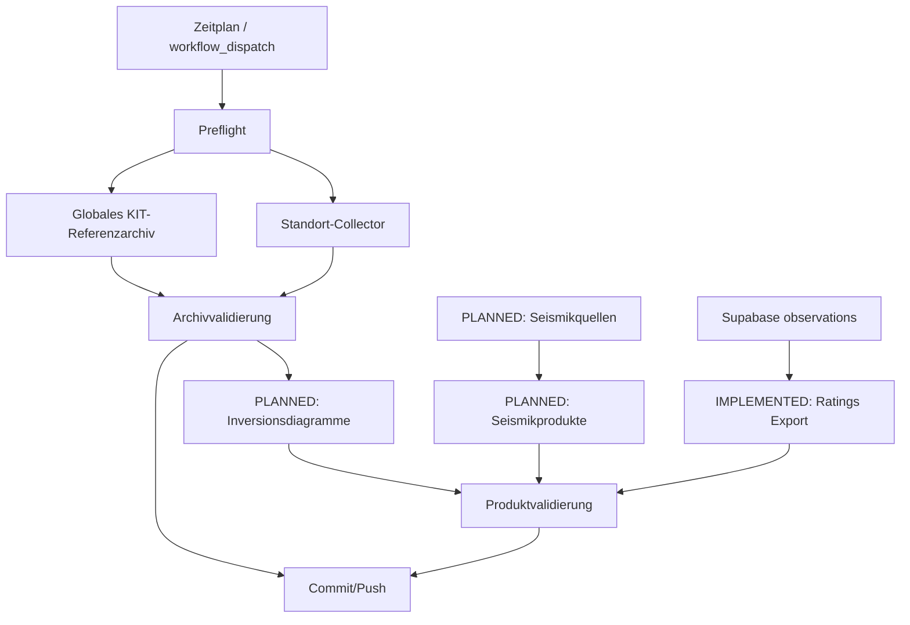

# Automation Dependency Graph

> Dokumentationsstand: 2026-09-19  \n> Software-Basis: Inversion Analyzer v0.15.25  \n> Statusbegriffe: **IMPLEMENTED** = im Quellstand nachweisbar; **PLANNED** = beschlossen/geplant, noch nicht implementiert; **OPEN** = Detailentscheidung fehlt.

## Abhängigkeitsregel

Rohdaten-/Archivpflege ist die primäre Schicht. Der Bewertungsexport ist seit v0.15.24 als separater nachgelagerter Workflow implementiert; weitere Datenprodukte bleiben geplant. Ein Ausfall in einer nachgelagerten Schicht darf die Integrität des primären Archivs nicht beeinträchtigen.
