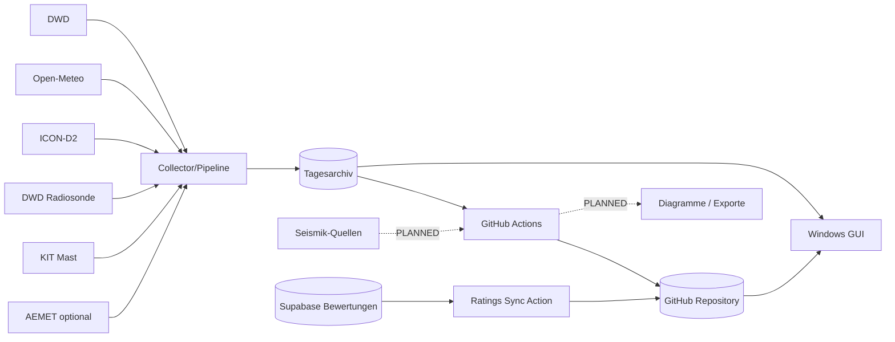

# System Architecture Document (SAD)

> Dokumentationsstand: 2026-09-19  \n> Software-Basis: Inversion Analyzer v0.15.24  \n> Statusbegriffe: **IMPLEMENTED** = im Quellstand nachweisbar; **PLANNED** = beschlossen/geplant, noch nicht implementiert; **OPEN** = Detailentscheidung fehlt.

## 1. Kontext

## 2. Laufzeitkomponenten

1. **GUI:** `Inversionskurve.py` → `inversion.gui.InversionApp`.
2. **Headless:** `Inversion_Server.py` für einmalige, geplante und KIT-only-Läufe.
3. **Pipeline:** `inversion/pipeline.py` ruft Quellen auf und erzeugt `DataBundle`.
4. **Berechnung:** `inversion/inversion_engine.py` und `inversion/kit_inversion.py`.
5. **Archiv:** `inversion/archive.py`, `archive_service.py`, `kit_reference_archive.py`.
6. **Remote-Fallback:** `inversion/remote_archive.py`.
7. **Automatisierung:** `.github/workflows/inversion_collect.yml` und `.github/workflows/supabase_ratings_sync.yml`.

## 3. Architekturprinzipien

- Ein gemeinsames Archiv für GUI und Headless-Verarbeitung.
- Datenquellen bleiben semantisch getrennt; Referenzdaten werden nicht stillschweigend in das Hauptmodell gemischt.
- Standortarchiv und globales KIT-Referenzarchiv sind getrennt.
- Netzwerkzugriff ist beim reinen Archiv-Navigieren der GUI nicht erforderlich.
- Teilläufe werden per Safe-Merge in vorhandene Tagesstände integriert.
- Kernquellen bestimmen Vollständigkeit; optionale Quellen blockieren standardmäßig keinen Retry.

## 4. Zielarchitektur

Der Supabase-Bewertungsexport ist seit v0.15.24 als separater nachgelagerter Workflow angebunden. Inversionsdiagramme, Seismikprodukte und Audioanalyse bleiben geplant. Die bestehende meteorologische Erfassung darf durch Fehler in nachgelagerten Produkten nicht beeinträchtigt werden.
