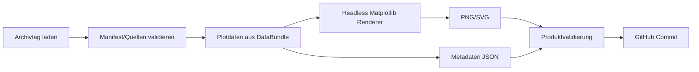

# Inversion Diagram Pipeline

> Dokumentationsstand: 2026-09-19  \n> Software-Basis: Inversion Analyzer v0.15.24  \n> Statusbegriffe: **IMPLEMENTED** = im Quellstand nachweisbar; **PLANNED** = beschlossen/geplant, noch nicht implementiert; **OPEN** = Detailentscheidung fehlt.

## 1. Status

**PLANNED.** v0.15.23 kann in der GUI darstellen/exportieren, erzeugt aber im vorhandenen GitHub-Workflow noch nicht den hier spezifizierten vollständigen automatischen Diagrammsatz.

## 2. Zielpipeline

## 3. Renderer-Anforderungen

- kein Tkinter-Zwang in Actions,
- deterministische Achsen/Labels für identische Eingaben,
- sichtbare Datenqualität und Datum/Ort,
- Referenzreihen klar getrennt,
- fehlende Daten werden als fehlend markiert,
- Eingangsmanifest-/Datenhashes in Metadaten.

## 4. Erzeugungszeitpunkt

Erzeugung erst nach Archiv-Safe-Merge und Validierung. Bei späteren Datenverbesserungen desselben Tages muss das Diagramm erneut erzeugt werden.

## 5. Tests

- vollständiger Beispieltag,
- Tag ohne DWD,
- Tag ohne optionale Referenzen,
- Tag ohne Vertikalprofil → kein scheinbar gültiges Inversionsdiagramm,
- identischer Input → identisches Metadatenobjekt (abgesehen von Erstellzeit, falls nicht normalisiert).
