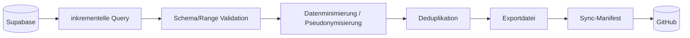

# Supabase to GitHub Transfer Specification

> Dokumentationsstand: 2026-09-19  \n> Software-Basis: Inversion Analyzer v0.15.25  \n> Statusbegriffe: **IMPLEMENTED** = im Quellstand nachweisbar; **PLANNED** = beschlossen/geplant, noch nicht implementiert; **OPEN** = Detailentscheidung fehlt.

## 1. Status und Ziel

**IMPLEMENTED für Bewertungen seit v0.15.24.** Audioübertragung und Audioanalyse bleiben **PLANNED**. Bewertungen werden aus Supabase in ein GitHub-Archiv transferiert, ohne Supabase-Secrets oder nicht freigegebene personenbezogene Daten in GitHub zu übertragen.

## 2. Datenfluss



## 3. Exportprinzip

- Primärschlüssel/Observation-ID muss stabil sein.
- Export wird deterministisch sortiert.
- Bereits exportierte IDs werden nicht erneut dupliziert.
- Ein abgebrochener Lauf ist wiederholbar.
- Erst nach erfolgreicher Dateivalidierung darf committed werden.

## 4. Felder

Das Phase-1-Schema ist in v0.15.24 festgelegt: `schema_version`, `event_id`, pseudonyme `observer_id`, `scheduled_time_utc`, `response_time_utc`, `rating`, datenschutzreduzierte `location`, `app_version`, `has_comment` und `source`. Präzise Koordinaten, Teilnehmerschlüssel und Kommentartext werden im Default nicht exportiert.

## 5. Secrets

Supabase URL/Project-Ref kann je nach Sicherheitsmodell öffentlich sein; API-Keys/Service-Role-Key sind jedoch als GitHub Actions Secrets zu behandeln. Service-Role nur verwenden, wenn Row-Level-Security/Exportweg dies wirklich erfordert; minimale Rechte bevorzugen.

## 6. Commit-Verhalten

Die Action verwendet die neutrale Commit-Nachricht `Update Supabase ratings archive`; Nutzerdaten werden nicht in Commit-Nachrichten geschrieben. Logs enthalten nur Summen und technische Statusangaben, nicht den Backend-Key oder Teilnehmerschlüssel.


## Implementierungsstand v0.15.24 – Phase 1 Bewertungen

**Status: IMPLEMENTED für Bewertungen; PLANNED für Audio.**

Datenfluss:

```text
Supabase observations
      ↓ HTTPS REST / secret key
48-h inkrementelles Überlappungsfenster
      ↓
Validierung und Normalisierung
      ↓
event_id-Deduplikation
      ↓
Datenschutzabbildung (GPS 2 Stellen, kein Kommentartext)
      ↓
UTC-Tagesarchiv ratings.jsonl + summary.json
      ↓
sync_state.json
      ↓
GitHub-Commit durch Action
```

Der erste Lauf ohne vorhandenen `sync_state.json` liest den vollständigen Bestand. Danach wird ab `max_response_time_utc - 48 h` erneut gelesen. Das Überlappungsfenster fängt verspätete App-Uploads ab, ohne Duplikate zu erzeugen.

### Zugang

Bevorzugtes Repository Secret: `SUPABASE_SECRET_KEY`. Legacy-Fallback: `SUPABASE_SERVICE_ROLE_KEY`. Die Projekt-URL kann über `SUPABASE_URL` überschrieben werden; der Default steht in `ratings_sync_config.json`.

### Nicht Bestandteil von Phase 1

- kein Audio-Download,
- keine L50/L90/Leq-Berechnung,
- kein Kommentartext-Export,
- keine Löschung von Supabase-Daten nach erfolgreichem Transfer.

## v0.15.25 – Pending-Datensätze
Noch nicht beantwortete Datensätze ohne `response_time` werden nicht in die Bewertungs-Zeitachse übernommen, wenn `rating` leer oder `-1` ist. Sie werden als `pending_skipped` gezählt. Eine echte Bewertung 0..5 ohne `response_time` bleibt ungültig und verhindert den Commit. Es wird bewusst kein Ersatzzeitstempel aus `scheduled_time` oder `created_at` verwendet.
